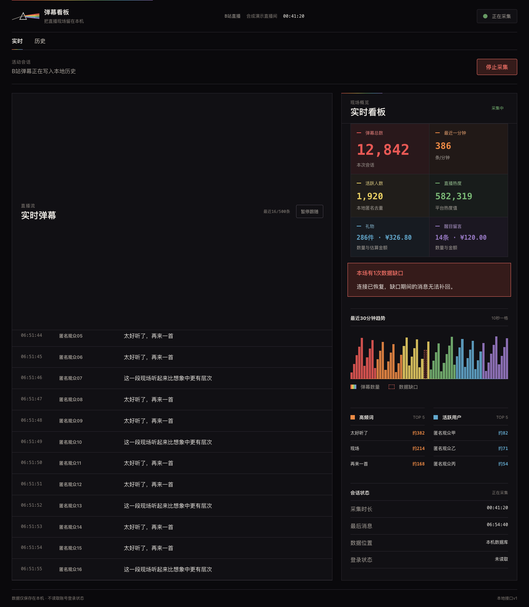
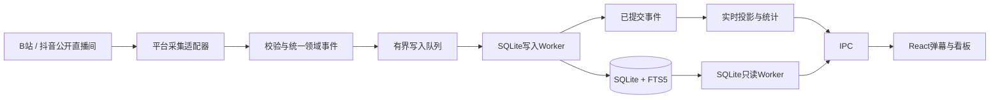

# 弹幕看板

[](https://github.com/932425174raul-lgtm/danmaku-dashboard/actions/workflows/windows-build.yml)

弹幕看板是一个运行在macOS与Windows上的本地桌面程序。它可以匿名连接B站或抖音公开直播间，实时显示弹幕与现场指标，同时把历史数据保存到本机SQLite数据库。

这个项目适合需要在直播过程中观察观众反应，或在直播结束后搜索历史弹幕的内容创作者、直播运营者和研究者。它不要求输入平台Cookie，不依赖主播账号，也不把历史上传到外部服务。

<p align="center">
  <a href="#功能概览">功能概览</a> ·
  <a href="#平台能力">平台能力</a> ·
  <a href="#安装">安装</a> ·
  <a href="#数据与隐私">数据与隐私</a> ·
  <a href="#本地开发">本地开发</a> ·
  <a href="#技术资料">技术资料</a>
</p>

## 界面预览



<sub>截图中的弹幕正文、用户名和指标都是合成演示数据，没有从线上直播录制真实弹幕。</sub>

宽窗口中，左侧是按接收时间排列的实时弹幕，右侧是数据看板。当窗口宽度低于760px时，界面会改为「弹幕」与「看板」两个页签，避免把两个长页面强行堆在一起。

## 功能概览

| 使用阶段 | 程序做什么 | 你能看到什么 |
| --- | --- | --- |
| 直播开始前 | 解析房间号或公开直播链接，B站房间未开播时继续等待 | 房间检查、等待开播、连接和失败原因 |
| 直播进行中 | 接收公开弹幕消息，完成格式校验、去重、本地写入和实时统计 | 最近500条弹幕、弹幕速率、活跃用户、趋势、高频词与平台指标 |
| 连接发生中断 | 轮换节点并自动重连，把无法保证完整性的区间记为数据缺口 | 恢复状态、缺口次数、开始时间和已有数据 |
| 关闭主窗口 | 窗口隐藏，主进程、采集器和写入Worker继续运行 | macOS菜单栏或Windows系统托盘仍显示采集状态，可重新打开看板或停止采集 |
| 直播结束后 | 保留已结束会话和弹幕索引 | 历史场次、摘要数据、分页弹幕、本场搜索和整场删除 |

### 实时弹幕

- 列表依次显示本机接收时间、展示名称和弹幕正文。
- 渲染进程最多保留最近500条弹幕DOM节点，长时间直播不会让页面节点无限增长。
- 默认自动跟随新消息。向上滚动后会暂停跟随，并在有新弹幕时提供返回最新位置的按钮。
- 长昵称会截断显示，长弹幕正文可换行，不会引起水平滚动。
- 页面内容按纯文本渲染，弹幕中的HTML和脚本不会当作界面执行。

### 实时看板

看板聚合的是已经写入SQLite的事件，因此实时数字与历史记录使用同一份数据事实。

- 弹幕总数和最近一分钟的弹幕速率。
- 基于本地匿名标识去重的活跃发言人数。
- B站直播热度、礼物数量与已知价值、醒目留言数量与金额。
- 最近30分钟弹幕趋势，每10秒一个统计桶。
- 连接中断期间的数据缺口标记，缺失区间不会被当作零互动。
- 高频词与活跃用户排行，高频词次数使用「约」显示，不冒充精确统计。

### 本地历史

- 历史页按场次保存平台、房间、开始时间、采集时长和结束状态。
- 弹幕详情每次读取100条，可以继续加载更早内容。
- 支持搜索当前场次的弹幕正文和展示名称，中文子串查询由SQLite FTS5 trigram索引处理。
- 整场删除需要二次确认。会话会先从界面隐藏，然后在写入Worker中分批清理，避免大场次删除占用主进程。

## 平台能力

两个平台共用同一套桌面生命周期、会话模型、SQLite历史和React界面，协议连接与字段解析则分别位于独立适配器中。

| 能力 | B站 | 抖音 |
| --- | --- | --- |
| 房间输入 | 房间号或`live.bilibili.com`链接 | 房间号或`live.douyin.com`链接 |
| 普通弹幕 | 支持 | 支持 |
| 礼物 | 支持已校验的公开事件 | 当前标记为不可用 |
| 醒目留言 | 支持 | 当前标记为不可用 |
| 平台热度 | 支持 | 当前标记为不可用 |
| 未开播等待 | 支持定时检查 | 当前不作为保证能力 |
| 历史保存与搜索 | 支持 | 支持普通弹幕 |
| 账号Cookie | 不读取 | 不读取 |

「不可用」不等于零。当匿名公开协议无法稳定提供某项指标时，界面会直接显示不可用，不会写入零值或制造假的完整性。

## 使用流程

1. 打开「弹幕看板」，选择B站或抖音。
2. 输入公开直播间号或直播链接，点击「开始采集」。
3. 连接建立后，左侧弹幕流和右侧看板会随已写入事件更新。
4. 需要查看较早弹幕时，向上滚动即可暂停自动跟随。
5. 关闭窗口后，如果仍在采集，程序会留在系统托盘。从托盘菜单可以重新显示窗口、停止采集或退出程序。
6. 采集结束后，进入「历史」查看场次摘要、搜索弹幕或删除整场数据。

## 安装

### 系统要求

| 系统 | 架构 | 发布产物 |
| --- | --- | --- |
| macOS 13.0或更高版本 | Apple Silicon | `danmaku-dashboard-<version>-macos-arm64.dmg` |
| Windows 10或Windows 11 | x64 | `danmaku-dashboard-<version>-windows-x64.zip` |

Intel Mac、Windows ARM64和32位Windows当前不在支持范围。

### 通过DMG安装

1. 从[最新Release](https://github.com/932425174raul-lgtm/danmaku-dashboard/releases/latest)下载`danmaku-dashboard-<version>-macos-arm64.dmg`。也可以按下文步骤在本机生成。
2. 打开DMG，把「弹幕看板」拖到「应用程序」。
3. 从「应用程序」打开弹幕看板。

当前版本使用ad-hoc签名，没有Apple Developer ID签名和公证票据。如果macOS首次打开时拦截，请在Finder的「应用程序」目录中按住Control点击应用，选择「打开」，然后再确认一次。

### Windows便携版

1. 从[最新Release](https://github.com/932425174raul-lgtm/danmaku-dashboard/releases/latest)下载`danmaku-dashboard-<version>-windows-x64.zip`。也可以下载Windows Actions中的构建产物，或按下文步骤自行构建。
2. 把ZIP完整解压到一个可写目录，不要只从压缩包中拖出EXE。
3. 运行目录中的`弹幕看板.exe`。

Windows便携版暂时没有代码签名。SmartScreen首次运行时可能显示未知发布者，请只从本仓库的Release或Actions产物下载，并在确认来源后选择「更多信息」与「仍要运行」。

### 卸载

在macOS删除应用，或在Windows删除便携版目录，都只会删除程序本体，不会自动删除已采集的历史。需要彻底清理时，请先退出程序，再删除下文列出的持久数据目录。

## 数据与隐私

### 本地数据位置

| 系统 | 持久数据目录 | Chromium会话数据 |
| --- | --- | --- |
| macOS | `~/Library/Application Support/弹幕看板/` | `~/Library/Caches/com.songjinzhao.danmaku-dashboard/Chromium/` |
| Windows | `%APPDATA%\弹幕看板\` | `%APPDATA%\弹幕看板\Chromium\` |

SQLite主数据库名为`library.sqlite3`，本地用户去重密钥密文名为`identity-key`，两者都位于对应系统的持久数据目录。

### 隐私边界

- 程序只请求平台公开直播所需的网络端点，不读取浏览器Cookie或账号登录状态。
- 原始用户ID只在协议规范化边界中短暂存在。数据库使用本机随机密钥生成的HMAC标识去重，不保存平台原始用户ID。
- HMAC密钥由Electron `safeStorage`使用macOS钥匙串或Windows DPAPI加密后保存，明文密钥不进入日志、IPC或测试产物。
- 历史、搜索词和弹幕正文不会被自动上传。第一版也不启动Electron自动崩溃上报。
- 日志不记录Cookie、临时令牌、原始用户ID、弹幕正文、搜索词或本地密钥。
- 平台匿名协议无法稳定提供的指标会显示为不可用，不会使用用户Cookie绕过验证码、设备校验或平台访问控制。

## 实现方式



渲染进程不能直接访问Node.js或SQLite。Electron主进程负责采集状态、窗口与菜单栏生命周期；写入Worker串行执行事务；只读Worker负责历史列表、分页与搜索。实时投影只消费写入Worker确认已提交的事件。

### 主要技术

| 层级 | 选择 | 职责 |
| --- | --- | --- |
| 桌面容器 | Electron 43 | 主窗口、系统托盘、单实例、本地路径与应用生命周期 |
| 界面 | React 19、TypeScript 6、Vite 8 | 实时弹幕、数据看板、历史与响应式界面 |
| 协议边界 | WebSocket、Zod | 公开直播协议连接、字段校验、统一事件转换与错误限界 |
| 存储 | Electron内置`node:sqlite`、WAL、FTS5 trigram | 会话、事件、统计投影、中文子串搜索与迁移备份 |
| 隔离 | Electron sandbox、窄preload API、独立读写Worker | 限制渲染进程权限，避免数据库工作阻塞WebSocket接收和界面更新 |
| 验证 | Vitest、React Testing Library、Playwright、平台产物检查 | 单元、数据库集成、界面、隐私和最终产物验证 |

### 项目目录

```text
src/
  contracts/          主进程、preload与渲染进程共享的IPC契约
  domain/             平台无关的直播领域事件
  main/
    collector/        B站与抖音采集器、采集会话协调
    protocol/         平台协议引导、解码、校验与规范化
    queue/            有界存储写入队列
    realtime/         实时指标、趋势和排行投影
    storage/          SQLite模式、迁移、查询与Worker客户端
    workers/          生产写入Worker与只读Worker
  preload/            渲染进程可以访问的窄API
  renderer/           React界面、棱镜主题与响应式布局
tests/
  unit/               协议、状态、IPC、存储客户端与界面测试
  integration/        临时SQLite数据库集成测试
docs/
  adr/                架构决策记录
  research/           协议、打包、性能与诊断调研
  spec/               实施规格和发布验收标准
```

## 本地开发

### 环境

- Apple Silicon Mac或Windows x64开发机。DMG与macOS系统验收依赖macOS，Windows运行时验收依赖Windows。
- Node.js 24.14.1。
- npm 11.11.0。

项目提交`.nvmrc`和`package-lock.json`，依赖版本需要按锁定文件安装。

```bash
npm ci
npm start
```

`npm start`启动Electron Forge开发模式。正常启动不会自动开始采集，只有在界面提交公开房间后才会访问对应平台。

### 检查命令

| 命令 | 用途 |
| --- | --- |
| `npm run format:check` | 检查Prettier格式 |
| `npm run typecheck` | 执行TypeScript项目引用检查 |
| `npm run lint` | 检查源码、测试和构建脚本 |
| `npm run test:unit` | 执行协议、状态、IPC、界面和客户端单元测试 |
| `npm run test:integration` | 在临时SQLite数据库中检查迁移、去重、历史、搜索和删除 |
| `npm run test:privacy` | 扫描测试与发布产物中的敏感内容 |
| `npm run test:performance:smoke` | 使用合成数据执行快速存储性能检查 |
| `npm run verify:fast` | 串行执行格式、lint、类型、单元、集成和隐私检查 |

### 打包Apple Silicon版本

```bash
npm run make:mac
npm run test:package:mac
```

`make:mac`会构建主进程、preload、两个SQLite Worker和React界面，然后生成ad-hoc签名的Apple Silicon应用和DMG。`test:package:mac`会检查架构、最低macOS版本、应用结构、Electron Fuses、asar边界和DMG可挂载性。

构建产物位于：

- `out/弹幕看板-darwin-arm64/弹幕看板.app`
- `out/make/弹幕看板-<version>-arm64.dmg`

DMG生成和挂载验证需要macOS允许`hdiutil`访问系统设备接口。`out/`已经加入`.gitignore`，发布时应当把DMG作为GitHub Release附件上传，不要直接提交到Git历史。

### 打包Windows x64便携版

```bash
npm run make:win
npm run test:package:win
```

`make:win`生成带项目图标的x64 PE应用与便携ZIP。`test:package:win`检查PE架构、Electron Fuses、asar内容和ZIP；在Windows机器上还会实际运行SQLite双Worker自检与两万条smoke基准。

构建产物位于：

- `out/弹幕看板-win32-x64/弹幕看板.exe`
- `out/make/zip/win32/x64/弹幕看板-win32-x64-<version>.zip`

仓库的`Windows x64` GitHub Actions会在真实Windows Runner上执行快速验证、打包和产物验收，并保留14天可下载ZIP。

### 真实B站协议冒烟

```bash
BILIBILI_PROBE_DURATION_MS=15000 npm run test:live-protocol -- <公开直播间号>
```

这项检查需要明确传入当时公开且正在直播的房间号，因此不进入默认测试。脚本只输出固定状态和脱敏计数，不保存房间、用户、正文、Cookie、临时令牌或原始帧。

## 当前验证状态

`v0.1.0`在2026-08-12的验证结果：

- Prettier、ESLint和TypeScript检查通过。
- 24个单元测试文件，共54项测试通过。
- 1个SQLite集成测试文件，共4项测试通过。
- 隐私扫描通过。
- Apple Silicon `.app`与DMG生成成功，最终产物架构与挂载检查通过。
- Windows x64便携ZIP已在GitHub Windows Runner上完成原生构建与运行验收；PE、应用图标、asar、Fuse、UTF-8文件名、SQLite双Worker和两万条smoke基准全部通过。
- 渲染预览在宽窗口和700px窄窗口中没有水平溢出，浏览器控制台没有运行错误。

持续采集、每秒200条事件和单场百万条事件的发布门槛与执行方式，详见[测试、诊断与脱敏日志规格](./docs/spec/testing-and-observability.md)。

## 已知边界

- 同一时间最多采集一个直播间。
- 采集使用平台公开网页协议，并非B站或抖音官方开放平台能力。上游协议变更后可能需要更新适配器。
- 匿名访问可能被平台风险控制限制。程序会显示脱敏错误并保留已写入数据，不会要求输入Cookie继续访问。
- 抖音第一版只保证普通弹幕。礼物、醒目留言、热度和观看人数目前不作为可用指标。
- 第一版没有Intel Mac构建、Windows ARM64构建、发行签名、公证、自动更新、应用商店发布、多房间并发、Excel导出、时间轴回放或多场对比。
- 这个工具不代表B站或抖音，也不提供对平台内容的访问授权。使用者需要自行遵守平台规则和所在地法律。

## 报告问题

报告协议或采集问题时，请提供直播平台、界面显示的公开错误码、操作系统版本和应用版本。不要在Issue中粘贴Cookie、临时令牌、设备标识、原始用户ID、本地数据库、完整网络帧或未脱敏弹幕。

## 技术资料

- [项目词汇表](./CONTEXT.md)
- [第一版实施规格](./docs/spec/implementation-plan.md)
- [实时监控界面规格](./docs/spec/realtime-ui.md)
- [B站网页弹幕协议契约](./docs/research/bilibili-web-protocol-contract-2026-07-29.md)
- [抖音公开直播协议可行性研究](./docs/research/douyin-live-protocol-feasibility-2026-07-31.md)
- [Electron进程与IPC契约](./docs/spec/electron-process-and-ipc.md)
- [SQLite事件模型与本地存储](./docs/spec/event-model-and-sqlite.md)
- [Windows x64打包与本地数据规格](./docs/spec/windows-x64-packaging-and-local-data.md)
- [架构决策记录](./docs/adr/0001-electron-react-typescript-sqlite.md)
- [棱镜编辑风界面设计](./docs/ui-20260812-prismatic-editorial-dashboard.md)

## 许可证

当前`package.json`标记为`UNLICENSED`，仓库还没有提供开源许可证。在许可证明确之前，公开查看代码不等于获得复制、修改或再分发的授权。
