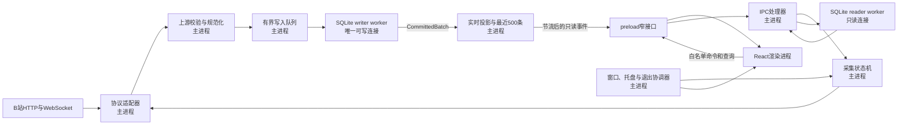

# Electron进程边界与IPC契约

## 1. 目标

本规格确定第一版macOS应用的运行时边界。它回答四个问题：

1. 直播连接、状态机、SQLite、窗口和托盘分别由谁拥有。
2. React能调用哪些能力，能看到哪些数据。
3. 大量弹幕到来时，如何避免阻塞Electron主线程或淹没渲染进程。
4. 窗口关闭、渲染进程崩溃和应用退出时，采集任务如何继续或安全停止。

本文中的主进程所有权，包含主进程直接执行的模块，以及由主进程创建和监管的Node worker。渲染进程不直接持有任何采集或存储资源。

## 2. 已确定结论

- B站HTTP请求、WebSocket连接、心跳、重连和采集状态机由Electron主进程拥有。
- SQLite连接位于两个由主进程监管的Node worker中：
  - writer worker是唯一可写连接，负责迁移、批量写入、持久化投影、删除和检查点。
  - reader worker只执行白名单只读查询，避免历史搜索阻塞写入。
- 只有完成SQLite事务提交的事件，才可进入实时界面。
- React运行在沙箱化渲染进程中，只能通过preload暴露的窄接口访问能力。
- preload不暴露`ipcRenderer`、Node API、文件路径、SQL或任意通道调用能力。
- 窗口关闭只隐藏窗口，不停止采集。应用退出必须先走受控停止和存储刷新。
- 上游临时凭据、原始UID和原始消息只允许在主进程采集链路中短暂存在，不进入worker、IPC、数据库和日志。

对应架构决策见[ADR 0003](../adr/0003-isolate-renderer-and-sqlite-workers.md)。

## 3. 运行时拓扑



### 3.1 所有权表

| 资源或职责 | 唯一所有者 | 说明 |
| --- | --- | --- |
| B站房间解析、WBI请求、临时凭据 | 主进程协议适配器 | 只请求固定B站端点，不接受任意目标URL |
| WebSocket、心跳、重连计时器 | 主进程采集服务 | 与单个`runId`绑定，可整体取消 |
| 采集状态机、会话和缺口状态 | 主进程 | 窗口销毁或重载不影响状态 |
| HMAC本地用户标识 | 主进程规范化模块 | 原始UID完成HMAC后立即丢弃 |
| SQLite写连接 | writer worker | 全应用仅一个，事务批量提交 |
| SQLite读连接 | reader worker | 只读、白名单查询、可独立重启 |
| 实时投影与最近500条缓存 | 主进程 | 数据只来自已提交批次 |
| BrowserWindow、托盘、退出流程 | 主进程 | 窗口关闭默认隐藏 |
| React组件和临时界面状态 | 渲染进程 | 不保存采集真相和数据库真相 |
| 能力桥接和数据裁剪 | preload | 不包含业务状态，不持有连接 |

## 4. 主进程模块边界

### 4.1 AppCoordinator

`AppCoordinator`负责启动顺序和顶层依赖装配：

1. 注册只读的`app://renderer/`资源协议。
2. 启动writer worker并完成数据库迁移。
3. 启动reader worker并验证只读连接。
4. 执行上次异常退出恢复。
5. 创建窗口、托盘和IPC处理器。
6. 恢复可显示的历史状态，但不自动恢复上游采集连接。

迁移失败时不得创建可操作的主界面。应用显示原生错误对话框，错误内容只包含公开错误码和本地诊断文件位置，不包含SQL、数据库内容或堆栈。

### 4.2 CollectorService

`CollectorService`封装一次运行实例，内部资源全部绑定到`runId`：

- 房间解析和直播状态查询。
- WebSocket创建、鉴权、心跳和消息解码。
- 重连退避和直播未开始轮询。
- `AbortController`以及所有计时器。
- 状态机命令。

新的运行实例开始前，旧实例必须完成取消。旧实例产生的异步结果携带旧`runId`，主进程直接丢弃，不能改变新实例状态。

### 4.3 Normalizer

`Normalizer`是外部不可信数据进入内部模型的唯一入口：

- 对命令类型、数组长度、文本长度和数值范围进行运行时校验。
- 把原始UID转换为`localUserKey`，随后移除原始UID。
- 把展示昵称和文本限制在存储规格规定的长度内。
- 丢弃未支持的字段，不保留完整原始消息。
- 生成应用内部事件，不把上游临时凭据放入事件。

只有规范化事件可以进入写入队列。

### 4.4 RealtimeProjectionStore

主进程维护一个仅供当前运行实例使用的内存投影：

- 最近500条已提交弹幕。
- 当前累计指标。
- 最近趋势、关键词和活跃用户投影。
- 最新数据库高水位。
- 单调递增的`realtimeRevision`。

writer worker返回`CommittedBatch`后，主进程才更新该投影。渲染进程因此不会看到随后因事务回滚而消失的数据。

## 5. SQLite worker边界

### 5.1 writer worker

writer worker拥有唯一可写SQLite连接。允许的内部命令固定为：

- `initialize`
- `appendBatch`
- `finalizeSession`
- `openGap`
- `closeGap`
- `prepareDeletion`
- `confirmDeletion`
- `checkpoint`
- `shutdown`

worker不接受SQL字符串、数据库路径或任意文件路径作为消息参数。数据库路径由主进程在创建worker时通过固定配置传入，渲染进程无法影响。

`appendBatch`以最多500条或100毫秒为一个事务。成功响应至少包含：

```ts
interface CommittedBatch {
  apiVersion: 1
  runId: string
  sessionId: number
  committedAtMs: number
  highWatermark: {
    receivedAtMs: number
    eventId: number
  }
  insertedCounts: {
    danmaku: number
    gift: number
    superChat: number
    popularity: number
  }
  projectionDelta: RealtimeProjectionDelta
}
```

`projectionDelta`只含界面所需的安全字段，不含`localUserKey`、原始UID、SQL或上游原始数据。

writer worker崩溃或失去写能力时，按存储故障处理：

1. 主进程停止从WebSocket继续收取新消息并关闭连接。
2. 状态机进入恢复流程，打开`storage`缺口。
3. 保留规格允许的有界队列，不无限积压。
4. 重新创建writer worker，重新打开数据库并执行读写探针。
5. 先提交有界队列，再恢复上游连接并关闭缺口。

### 5.2 reader worker

reader worker只用只读模式打开数据库。允许的查询名固定为：

- `listSessions`
- `getSession`
- `listDanmaku`
- `searchDanmaku`
- `listGifts`
- `listSuperChats`

每个查询由worker内部的预定义语句实现，不接受排序列、表名或SQL片段。所有游标、页大小和搜索文本在主进程校验后才进入worker。

reader worker崩溃不会停止采集。主进程返回可重试的`READ_UNAVAILABLE`，重建reader worker后恢复历史查询。

### 5.3 内部消息约束

主进程与worker的消息统一包含：

```ts
interface WorkerRequest<T> {
  apiVersion: 1
  requestId: string
  type: string
  payload: T
}

type WorkerResponse<T> =
  | { apiVersion: 1; requestId: string; ok: true; data: T }
  | { apiVersion: 1; requestId: string; ok: false; error: WorkerPublicError }
```

约束如下：

- 每个worker的在途请求数和队列长度有固定上限。
- 超时请求从主进程登记表移除，迟到响应被丢弃。
- worker输出也执行运行时校验，防止损坏数据库值进入IPC。
- 只使用参数化语句。
- worker错误在边界处转换，不向渲染进程传递堆栈。

## 6. BrowserWindow安全配置

生产窗口采用以下基线：

```ts
const windowOptions: Electron.BrowserWindowConstructorOptions = {
  width: 1280,
  height: 820,
  minWidth: 620,
  minHeight: 640,
  show: false,
  webPreferences: {
    preload: fixedPreloadPath,
    contextIsolation: true,
    sandbox: true,
    nodeIntegration: false,
    webSecurity: true,
    allowRunningInsecureContent: false,
    devTools: false
  }
}
```

附加限制：

- 生产环境只加载`app://renderer/index.html`。
- `app://renderer/`只服务打包后的renderer目录，必须做路径归一化和目录包含检查。
- 拒绝所有窗口导航和新窗口请求。
- 拒绝所有权限请求和非预期下载。
- 不把外部页面加载到应用窗口。
- 未来若增加帮助链接，由主进程使用固定HTTPS域名白名单打开系统浏览器。
- 开发服务器和开发者工具只在非打包开发模式启用，相关例外不得进入生产配置。

生产CSP：

```text
default-src 'self';
script-src 'self';
style-src 'self';
img-src 'self' data:;
connect-src 'none';
object-src 'none';
base-uri 'none';
frame-ancestors 'none'
```

弹幕、昵称、勋章名称和错误文案全部按纯文本渲染。不得使用`dangerouslySetInnerHTML`展示任何上游内容。

## 7. preload公开接口

渲染进程只获得`window.danmakuApp`。不暴露`ipcRenderer`本身，也不提供`invoke(channel, payload)`一类通用方法。

```ts
interface DanmakuAppApi {
  app: {
    ready(input: ReadyInput): Promise<Result<BootstrapSnapshot>>
    requestQuit(): Promise<Result<QuitRequestResult>>
    resolveQuit(input: ResolveQuitInput): Promise<Result<void>>
    subscribeRequests(listener: (event: AppRequestEvent) => void): Unsubscribe
  }
  collector: {
    start(input: StartCollectorInput): Promise<Result<CollectorStateView>>
    stop(input: StopCollectorInput): Promise<Result<CollectorStateView>>
    retryNow(input: RetryCollectorInput): Promise<Result<CollectorStateView>>
    subscribeState(listener: (event: CollectorStateEvent) => void): Unsubscribe
  }
  realtime: {
    subscribe(listener: (event: RealtimeEvent) => void): Unsubscribe
  }
  history: {
    list(input: ListSessionsInput): Promise<Result<CursorPage<HistorySummary>>>
    get(input: GetSessionInput): Promise<Result<HistoryDetail>>
    listDanmaku(input: ListDanmakuInput): Promise<Result<CursorPage<DanmakuView>>>
    searchDanmaku(input: SearchDanmakuInput): Promise<Result<CursorPage<DanmakuView>>>
    listGifts(input: ListGiftsInput): Promise<Result<CursorPage<GiftView>>>
    listSuperChats(input: ListSuperChatsInput): Promise<Result<CursorPage<SuperChatView>>>
    prepareDelete(input: PrepareDeleteInput): Promise<Result<DeleteConfirmation>>
    confirmDelete(input: ConfirmDeleteInput): Promise<Result<DeleteStarted>>
    subscribeDeletion(listener: (event: DeletionEvent) => void): Unsubscribe
  }
}

type Unsubscribe = () => void

type Result<T> =
  | { apiVersion: 1; ok: true; data: T }
  | { apiVersion: 1; ok: false; error: PublicError }

interface PublicError {
  code: PublicErrorCode
  message: string
  retryable: boolean
}
```

preload订阅回调只传业务载荷，不把Electron的`IpcRendererEvent`传给页面。每次订阅返回独立的取消函数，React组件卸载时必须调用。

### 7.1 固定通道

主进程仅注册以下版本化固定通道：

| preload方法 | IPC通道 | 模式 |
| --- | --- | --- |
| `app.ready` | `v1:app:ready` | invoke |
| `app.requestQuit` | `v1:app:request-quit` | invoke |
| `app.resolveQuit` | `v1:app:resolve-quit` | invoke |
| `collector.start` | `v1:collector:start` | invoke |
| `collector.stop` | `v1:collector:stop` | invoke |
| `collector.retryNow` | `v1:collector:retry-now` | invoke |
| `history.list` | `v1:history:list` | invoke |
| `history.get` | `v1:history:get` | invoke |
| `history.listDanmaku` | `v1:history:list-danmaku` | invoke |
| `history.searchDanmaku` | `v1:history:search-danmaku` | invoke |
| `history.listGifts` | `v1:history:list-gifts` | invoke |
| `history.listSuperChats` | `v1:history:list-super-chats` | invoke |
| `history.prepareDelete` | `v1:history:prepare-delete` | invoke |
| `history.confirmDelete` | `v1:history:confirm-delete` | invoke |
| `app.subscribeRequests` | `v1:event:app-request` | push |
| `collector.subscribeState` | `v1:event:collector-state` | push |
| `realtime.subscribe` | `v1:event:realtime` | push |
| `history.subscribeDeletion` | `v1:event:deletion` | push |

主进程处理器必须同时确认：

- 发送者是当前主窗口的`webContents.id`。
- 请求来自顶层frame。
- 输入通过对应运行时schema。
- 当前操作允许在此状态执行。

事件只允许发送给已经完成`app.ready`登记的当前主窗口，不向DevTools、其他窗口或全部`webContents`广播。

## 8. IPC数据契约

### 8.1 通用标识和顺序

- 所有IPC输入和输出均带`apiVersion: 1`。
- `CollectorStateView`带单调递增的`stateRevision`和当前`runId`。
- `RealtimeEvent`带单调递增的`realtimeRevision`、`runId`和数据库高水位。
- 渲染进程丢弃旧`runId`或不大于当前revision的事件。
- 会话和事件ID按SQLite安全整数传输，确认ID按不透明字符串传输。渲染进程不得从ID推导业务含义。

### 8.2 启动快照

React先安装所有订阅，再调用：

```ts
interface ReadyInput {
  apiVersion: 1
}
```

主进程把该`webContents`登记为当前可投递目标，并返回完整快照：

```ts
interface BootstrapSnapshot {
  apiVersion: 1
  collector: CollectorStateView
  realtime: {
    revision: number
    runId: string | null
    highWatermark: EventCursor | null
    metrics: RealtimeMetricsView
    trend: TrendPointView[]
    keywords: KeywordView[]
    activeUsers: ActiveUserView[]
    recentDanmaku: DanmakuView[]
  }
  ui: {
    defaultPage: 'live'
    windowVisible: boolean
  }
}
```

`recentDanmaku`最多500条。窗口重新显示、渲染进程重载或崩溃重建后都重新执行此流程，不回放隐藏期间的IPC消息。

首次同步按以下顺序防止竞态：

1. React安装订阅，并在快照返回前临时缓冲收到的事件。
2. `app.ready`处理器登记当前`webContents`，在同一主进程任务中读取完整快照。
3. React应用快照，再按revision顺序应用缓冲中比快照新的事件。
4. 旧`runId`、旧revision和重复事件全部丢弃。

### 8.3 采集命令

```ts
interface StartCollectorInput {
  apiVersion: 1
  roomInput: string
}

interface StopCollectorInput {
  apiVersion: 1
  runId: string
  reason: 'user_stop'
}

interface RetryCollectorInput {
  apiVersion: 1
  runId: string
}
```

约束：

- `roomInput`去除首尾空白后长度为1至512。
- 只接受纯数字房间号，或能解析出纯数字房间号的固定B站直播域名URL。
- 用户输入不得决定请求协议、主机、端口或路径。
- `start`在不可开始状态下不创建第二个采集器，返回`COLLECTOR_BUSY`和当前状态。
- `stop`和`retryNow`必须匹配当前`runId`，否则返回`STALE_RUN`。

### 8.4 历史查询

会话分页上限50，事件分页上限100。所有分页都使用稳定游标，不使用大偏移量。

```ts
interface SessionCursor {
  startedAtMs: number
  sessionId: number
}

interface EventCursor {
  receivedAtMs: number
  eventId: number
}

interface ListSessionsInput {
  apiVersion: 1
  cursor?: SessionCursor
  limit: number
}

interface GetSessionInput {
  apiVersion: 1
  sessionId: number
}

interface ListDanmakuInput {
  apiVersion: 1
  sessionId: number
  cursor?: EventCursor
  limit: number
}

interface SearchDanmakuInput extends ListDanmakuInput {
  query: string
}

interface ListGiftsInput extends ListDanmakuInput {}

interface ListSuperChatsInput extends ListDanmakuInput {}
```

`query`去除首尾空白后长度为1至200个Unicode字符。1至2个字符使用reader worker中的参数化子串查询，3个字符以上使用FTS5三元组索引。礼物和醒目留言查询沿用相同的事件游标结构。

渲染进程可见的弹幕字段限制为：

```ts
interface DanmakuView {
  eventId: number
  receivedAtMs: number
  displayName: string
  text: string
  medal: {
    name: string
    level: number
  } | null
}
```

界面不得获得`localUserKey`、原始UID或任何可用于跨会话反查上游用户的字段。活跃用户投影只包含展示昵称和当前会话内聚合值。

### 8.5 删除

删除必须两阶段完成：

1. `prepareDelete({sessionId})`由主进程重新查询目标，返回会话标题、日期以及一个30秒有效的`confirmationId`。
2. React显示明确确认框。
3. `confirmDelete({confirmationId})`只删除该确认所绑定的会话。

`confirmationId`只存在主进程内存中，绑定创建它的`webContents.id`，使用一次即失效，不写日志。删除仍按存储规格执行先逻辑删除、后物理批量清理。

```ts
interface PrepareDeleteInput {
  apiVersion: 1
  sessionId: number
}

interface DeleteConfirmation {
  sessionId: number
  confirmationId: string
  roomTitle: string
  startedAtMs: number
  expiresAtMs: number
}

interface ConfirmDeleteInput {
  apiVersion: 1
  confirmationId: string
}

interface DeleteStarted {
  deletionId: string
  sessionId: number
}
```

### 8.6 退出请求

```ts
interface QuitRequestResult {
  requestId: string | null
  requiresConfirmation: boolean
}

interface ResolveQuitInput {
  apiVersion: 1
  requestId: string
  decision: 'cancel' | 'quit'
}
```

退出请求ID只存在主进程内存中，绑定创建它的退出流程，不能用于其他操作。

### 8.7 公开错误码

第一版公开错误码至少包括：

- `INVALID_INPUT`
- `ROOM_NOT_FOUND`
- `COLLECTOR_BUSY`
- `STALE_RUN`
- `ACTION_NOT_ALLOWED`
- `UPSTREAM_UNAVAILABLE`
- `ANONYMOUS_ACCESS_LIMITED`
- `READ_UNAVAILABLE`
- `STORAGE_UNAVAILABLE`
- `NOT_FOUND`
- `CONFIRMATION_EXPIRED`
- `RATE_LIMITED`
- `APP_SHUTTING_DOWN`
- `INTERNAL_ERROR`

错误消息使用产品级中文文案。错误对象不包含堆栈、SQL、数据库路径、上游响应正文、临时凭据或原始消息。

## 9. 实时推送与背压

### 9.1 推送频率

| 数据 | 最大推送频率 | 载荷策略 |
| --- | --- | --- |
| 采集状态变化 | 变化时立即，50毫秒内合并重复状态 | 每次发送完整状态快照 |
| 新弹幕和核心数字 | 每250毫秒一次 | 增量弹幕加当前完整数字 |
| 趋势、关键词、活跃用户 | 每1秒一次 | 当前完整投影 |
| 删除进度 | 每250毫秒一次 | 当前任务进度 |

每个实时IPC载荷上限256 KiB。单次新增弹幕最多200条。超过时只发送最新可显示部分，并携带`displaySkippedCount`。SQLite仍保存全部已提交事件，界面明确显示本次为保证流畅而跳过的展示条数。

### 9.2 隐藏窗口

窗口隐藏、销毁或尚未调用`app.ready`时：

- 主进程停止向renderer发送实时消息。
- 不为renderer积累待发送消息。
- 继续采集、存储和更新主进程投影。
- 仅保留最近500条展示弹幕和当前投影。

窗口再次出现后使用完整`BootstrapSnapshot`同步，不逐条补发隐藏期间消息。

### 9.3 IPC调用限流

主进程按`webContents.id`实施限流：

- 同类历史查询最多4个在途请求。
- 所有历史查询合计每秒最多10次。
- 采集控制命令每秒最多4次。
- 删除确认同一时间只允许1个。

超过限制返回`RATE_LIMITED`。开始、停止和重试命令保持幂等，重复点击不能创建重复连接或重复关闭会话。

## 10. 窗口、托盘和应用退出

### 10.1 关闭和恢复窗口

- 用户点击窗口关闭按钮时，若不在退出流程，阻止销毁并隐藏窗口。
- `window-all-closed`在macOS上不调用`app.quit()`。
- 点击Dock图标或托盘中的显示看板时，显示现有窗口；窗口已销毁则安全重建。
- 窗口显示后重新执行订阅和`app.ready`握手。
- renderer崩溃或无响应不停止采集。主进程记录脱敏诊断并提供重载或重建窗口。

托盘由主进程持有，至少提供：

- 显示看板
- 当前采集状态摘要
- 停止采集，仅活动时可用
- 导出诊断摘要
- 退出应用

导出诊断摘要由主进程直接打开系统保存对话框并写入脱敏JSON，不经过renderer选择任意源文件，也不自动上传。

### 10.2 退出协调

所有退出入口，包括`Cmd+Q`、Dock退出、托盘退出和系统关机事件，都进入同一个`QuitCoordinator`。

无活动采集时：

1. 设置`isQuitting`。
2. 停止接收新IPC。
3. 关闭reader worker。
4. 要求writer worker执行检查点和关闭。
5. 销毁托盘和窗口。
6. 退出。

存在活动或等待中的采集时：

1. 若renderer可用，推送`quitConfirmationRequested`并显示确认框。
2. renderer不可用时，主进程显示原生确认对话框。
3. 用户取消则清除退出请求，不改变采集状态。
4. 用户确认后设置`isQuitting`，状态机以`app_quit`停止。
5. 关闭上游连接，完成队列中的已接收事件，关闭未闭合缺口并结束会话。
6. writer worker执行检查点并关闭。
7. 全流程软上限10秒。

10秒后仍无法完成时，保留活动会话标记并强制结束进程。下次启动按异常退出恢复规格把该会话标记为中断，不伪造正常结束。

退出确认请求包含唯一`requestId`。`app.resolveQuit`必须匹配仍有效的请求，旧窗口或旧确认不得批准新的退出流程。

## 11. 威胁模型与控制

### 11.1 保护对象

- 上游临时凭据和原始UID。
- SQLite数据库、应用HMAC密钥和本地历史记录。
- 正在运行的采集任务。
- 删除、停止和退出等破坏性操作。
- 主进程和worker的可用性。

### 11.2 信任边界

| 边界 | 主要风险 | 控制 |
| --- | --- | --- |
| B站网络到主进程 | 畸形帧、超长字段、协议变化 | 解压上限、运行时schema、长度限制、未知命令丢弃 |
| 用户房间输入到网络请求 | SSRF、任意协议或主机 | 只提取房间号，请求固定端点 |
| renderer到主进程 | XSS后调用高权限能力 | sandbox、窄preload、固定通道、发送者校验、输入schema、限流 |
| 主进程到SQLite worker | 任意SQL、路径注入、队列失控 | 白名单消息、固定路径、参数化语句、有界队列 |
| SQLite到renderer | 敏感字段泄漏、损坏值 | 只读视图模型、输出schema、字段裁剪 |
| 上游文本到React | 脚本注入、外链导航 | 纯文本渲染、CSP、禁止导航和新窗口 |

### 11.3 禁止项

- 不使用Electron remote能力。
- 不在renderer中导入`electron`、`fs`、SQLite驱动或Node内置模块。
- 不允许renderer直接读取应用数据目录。
- 不允许任意IPC通道、任意SQL、任意文件路径或任意网络URL。
- 不把Cookie、临时凭据、原始UID、`localUserKey`、完整上游消息写入日志。
- 不在`localStorage`保存采集状态、历史数据或任何敏感数据。第一版只允许在renderer内存中保存页面选择等短期界面状态。

## 12. 可观测性边界

主进程日志可记录：

- 公共错误码。
- `runId`和内部会话ID。
- 状态变化。
- 批次条数、提交耗时和队列深度。
- worker启动、重启和退出原因。
- IPC通道名、耗时和结果类别。

日志不得记录：

- 房间接口完整响应。
- WebSocket完整帧和弹幕文本。
- 昵称、原始UID和`localUserKey`。
- 临时凭据、Cookie和请求头。
- 搜索词。
- 删除确认ID。

renderer只显示公开错误，不负责写持久诊断日志。

## 13. 验收场景

实现必须通过以下行为验收：

1. 开始采集后关闭窗口，数据库事件数仍持续增长；重新显示窗口后看到最新快照。
2. renderer执行`window.require`、导入`fs`或访问`ipcRenderer`均失败。
3. renderer尝试调用未公开通道、从子frame调用或伪造超大分页参数均被拒绝。
4. 弹幕文本包含HTML和脚本片段时只显示文字，不执行代码或导航。
5. writer事务失败后，失败批次不会出现在实时列表；采集进入存储恢复流程。
6. reader worker崩溃时实时采集继续，历史页显示可重试错误，worker恢复后查询成功。
7. 每秒200条弹幕时，renderer接收频率不超过4次每秒，IPC单包不超过256 KiB。
8. renderer崩溃后主进程仍采集；窗口重建通过`app.ready`获得最近500条和当前投影。
9. 活动采集时按`Cmd+Q`会确认；取消不影响采集，确认后会话和数据库在10秒内安全关闭。
10. 删除确认超过30秒、来自旧窗口或重复使用时均失败，目标会话不被误删。
11. 静态扫描确认renderer产物不包含SQLite驱动、Node内置模块引用和通用IPC桥。
12. 日志扫描确认不存在Cookie、临时凭据、原始UID、弹幕文本和搜索词。
