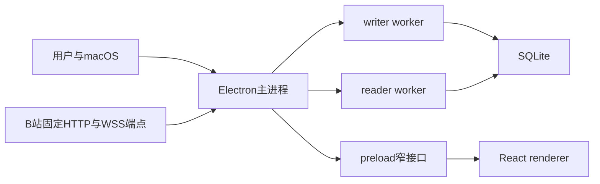

# B站弹幕看板第一版实施规格

版本：`v1`

日期：2026-07-29

目标版本：`0.1.0`

## 1. 文档作用

本文是第一版编码阶段的主入口，固定：

- 项目目录和模块依赖。
- 依赖版本与构建方式。
- 数据库迁移拆分。
- 正常应用、开发测试和产物验证的入口边界。
- 9个编码里程碑与1个发布里程碑。
- 每个里程碑的文件范围、完成条件、验收命令和可安全交付点。
- 第一版最终验收命令与人工证据。

详细字段、状态、界面和阈值继续由专题规格负责，本文不复制完整DDL或IPC类型。

## 2. 权威顺序

发生理解差异时按以下顺序处理：

1. [项目规范](../../AGENTS.md)决定安全红线和第一版范围。
2. [项目词汇表](../../CONTEXT.md)决定用户可见概念与命名。
3. `docs/adr/`决定已经接受的架构。
4. 本文决定文件位置、依赖版本、实施顺序和验收组合。
5. `docs/spec/`中的专题规格决定各模块的详细行为。
6. `docs/research/`和`docs/prototypes/`只作为事实依据和原型证据，不能覆盖正式规格。

发现专题规格互相冲突时必须先修正文档再编码，不能由实现者自行选择。协议契约目前位于[网页直播弹幕协议契约](../research/bilibili-web-protocol-contract-2026-07-29.md)，它是第一个适配器版本的规范性例外。

## 3. 第一版固定边界

必须实现：

- Apple Silicon、macOS 13及以上的本地Electron应用。
- 同时最多一个公开B站直播间。
- 房间号或`live.bilibili.com`链接输入。
- 匿名采集，不读取Cookie或主播身份码。
- 等待开播、自动重连、匿名访问受限和数据缺口。
- 普通弹幕、礼物、醒目留言、直播状态、连接状态和热度。
- SQLite历史、会话详情、单场搜索和整场删除。
- 宽窗口同时显示实时弹幕与实时看板。
- 窄窗口通过弹幕与看板页签切换。
- 关闭窗口后由菜单栏继续后台采集。
- `.app`和DMG本机发行产物。
- 脱敏日志、用户主动诊断摘要、容量测试和发布验收。

不实现：

- Cookie、登录态、B站开放平台和主播身份码。
- 多直播间并发。
- Intel、通用二进制、Developer ID、公证、自动更新和Mac App Store。
- 跨场搜索、导出业务数据、时间轴回放和多场对比。
- 云同步、远程控制和多人协作。
- 用户进入、点赞、关注或榜单事件。

## 4. 固定技术基线

### 4.1 运行和构建

| 依赖 | 精确版本 |
| --- | --- |
| 开发Node.js | `24.14.1` |
| npm | `11.11.0` |
| Electron | `43.2.0` |
| Electron内置Node.js | `24.18.0` |
| Electron Forge全部包 | `7.11.2` |
| `@electron/fuses` | `2.1.3` |
| Vite | `8.1.5` |
| `@vitejs/plugin-react` | `6.0.4` |
| TypeScript | `6.0.3` |
| ESLint | `10.8.0` |
| `typescript-eslint` | `8.65.0` |
| Prettier | `3.9.6` |

TypeScript固定为`6.0.3`，不使用调研日npm的`7.x`最新标签，因为`typescript-eslint 8.65.0`声明的上限是`<6.1.0`。

Forge的Vite插件仍标为实验能力，因此必须锁定`@electron-forge/plugin-vite@7.11.2`。升级Forge或Vite任一版本时先运行最小打包探测，再执行全部Electron、隐私和产物测试。

### 4.2 运行时依赖

| 依赖 | 精确版本 | 用途 |
| --- | --- | --- |
| `react` | `19.2.8` | renderer界面 |
| `react-dom` | `19.2.8` | renderer挂载 |
| `zod` | `4.4.3` | 网络、worker、IPC、日志和设置运行时schema |
| `ws` | `8.21.1` | 主进程WebSocket传输适配器 |

不引入ORM、路由器、全局状态库、图表库、日志库、CSS框架或组件库：

- SQLite使用Electron内置`node:sqlite`和参数化SQL。
- HTTP使用Electron内置Node.js的`fetch`。
- 页面只有实时与历史两个主导航，由React状态控制。
- 趋势图使用项目内受限SVG组件。
- 主状态来自preload订阅，renderer只用React状态。
- 日志使用固定判别联合和JSON序列化器。
- 样式使用普通CSS与设计token。

新增运行时依赖必须单独说明为什么现有平台能力不能满足，并重新运行许可证、asar和隐私检查。

### 4.3 测试依赖

| 依赖 | 精确版本 |
| --- | --- |
| Vitest | `4.1.7` |
| `@vitest/coverage-v8` | `4.1.7` |
| `@playwright/test` | `1.61.0` |
| `@testing-library/react` | `16.3.2` |
| `@testing-library/user-event` | `14.6.1` |
| `@testing-library/jest-dom` | `7.0.0` |
| jsdom | `29.1.1` |

这些版本以[测试与诊断工具调研](../research/testing-and-observability-2026-07-29.md)验证组合为准，不跟随npm最新标签自动升级。

### 4.4 锁文件

- `package.json`中的所有直接依赖使用精确版本，不使用`^`或`~`。
- `packageManager`固定为`npm@11.11.0`。
- `.nvmrc`固定为`24.14.1`。
- 提交`package-lock.json`，只使用`npm ci`构建。
- 任何依赖升级单独提交，不能和业务功能混在一起。

版本来源：

- [Electron 43.2.0](https://releases.electronjs.org/release/v43.2.0)
- [Electron Forge 7.11.2](https://www.npmjs.com/package/@electron-forge/cli/v/7.11.2)
- [Forge Vite插件说明](https://www.electronforge.io/config/plugins/vite)
- [Electron Fuses](https://www.electronjs.org/docs/latest/tutorial/fuses)
- [React npm元数据](https://registry.npmjs.org/react/latest)
- [TypeScript npm元数据](https://registry.npmjs.org/typescript/latest)

## 5. 运行时形态

### 5.1 正常应用



边界：

- 主进程拥有协议、状态机、实时投影、窗口、菜单栏、日志和退出。
- writer拥有唯一写连接。
- reader只执行预定义查询。
- preload只导出`window.danmakuApp`。
- renderer只导入IPC安全契约，不导入领域事件、worker消息、Electron或Node。
- 只有SQLite提交成功的事件进入主进程实时投影和renderer。

### 5.2 未打包开发测试

`src/testing/electron-main.ts`是单独的Electron入口：

- 使用合成HTTP与WebSocket传输。
- 允许依赖注入时钟、随机源、worker工厂和故障控制器。
- 允许把数据根目录设置为每个用例的临时目录。
- 只由Playwright配置和测试构建引用。
- 不被正式`forge.config.ts`或正式Vite入口引用。

正式asar扫描必须确认该文件、故障IPC和测试schema都不存在。

### 5.3 正式产物验证

正式主入口只识别：

```text
--verify-runtime
--benchmark-profile=smoke|million|sustained|soak
```

它们动态加载`src/main/verification/`，不加载测试目录：

- 不创建窗口、菜单栏、采集会话或网络请求。
- 只使用固定合成数据和系统临时目录。
- 不接受路径、SQL、URL、模块名或故障参数。
- 输出一个脱敏JSON对象。
- 关闭worker并删除临时数据库后退出。

正常应用和验证模式共用同一套迁移、writer、reader、队列和投影生产模块。验证模式不能进入用户Application Support目录。

## 6. 目录与依赖规则

目标目录：

```text
assets/
  icon.icns
  tray-idleTemplate.png
  tray-idleTemplate@2x.png
  tray-collectingTemplate.png
  tray-collectingTemplate@2x.png
  tray-waitingTemplate.png
  tray-waitingTemplate@2x.png
  tray-warningTemplate.png
  tray-warningTemplate@2x.png

scripts/
  maker-dmg.ts
  check-sensitive-artifacts.mjs
  resolve-macos-artifacts.mjs
  verify-macos-artifact.mjs
  verify-package-contents.mjs
  write-release-manifest.mjs

src/
  contracts/
    ipc-v1/
      api.ts
      collector.ts
      errors.ts
      history.ts
      realtime.ts
      schemas.ts
  domain/
    events.ts
    money.ts
    text.ts
    time.ts
  main/
    index.ts
    app-coordinator.ts
    environment.ts
    paths.ts
    collector/
      collector-service.ts
      session-machine.ts
      retry-policy.ts
      run-generation.ts
    protocol/
      bilibili-web-v1/
        adapter.ts
        bootstrap.ts
        decoder.ts
        normalizer.ts
        packet.ts
        schemas.ts
        wbi.ts
    queue/
      bounded-event-queue.ts
      batch-scheduler.ts
    realtime/
      projection-store.ts
      ring-buffer.ts
      space-saving.ts
      tokenizer.ts
    storage/
      database-paths.ts
      hmac-key-store.ts
      migration-runner.ts
      reader-client.ts
      worker-client.ts
      writer-client.ts
      migrations/
        001_core.sql
        002_projections_and_search.sql
    workers/
      contracts.ts
      reader.ts
      writer.ts
      statements/
        history.ts
        search.ts
        write.ts
    ipc/
      handlers.ts
      rate-limiter.ts
      sender-validation.ts
      subscriptions.ts
    lifecycle/
      app-protocol.ts
      quit-coordinator.ts
      tray-controller.ts
      window-controller.ts
    logging/
      events.ts
      logger.ts
      rotation.ts
      safe-error.ts
    diagnostics/
      export.ts
      schema.ts
    settings/
      schema.ts
      store.ts
    verification/
      runner.ts
      runtime-probe.ts
      synthetic-load.ts
  preload/
    index.ts
  renderer/
    index.html
    main.tsx
    app.tsx
    env.d.ts
    styles/
      tokens.css
      global.css
    components/
      confirmation-dialog.tsx
      status-banner.tsx
      trend-chart.tsx
    features/
      live/
      dashboard/
      history/
    state/
      bootstrap.ts
      subscriptions.ts
  testing/
    electron-main.ts
    fault-controller.ts
    synthetic-transport.ts

tests/
  fixtures/
    bilibili-web-v1/
    ipc-v1/
    migrations/
    ui/
  helpers/
  unit/
  component/
  integration/
  electron/
  performance/
  privacy/
  package/

artifacts/
  verification/
```

`artifacts/`、Playwright结果、覆盖率、Forge输出、数据库、日志和DMG全部加入`.gitignore`。

依赖方向：

```text
renderer -> contracts/ipc-v1
preload -> contracts/ipc-v1 + Electron contextBridge
main -> contracts/ipc-v1 + domain + main内部模块
workers -> domain + main/workers内部契约
testing -> production模块 + testing辅助
```

禁止方向：

- `renderer`不能导入`main`、`domain`、`workers`、`electron`或Node内置模块。
- `contracts/ipc-v1`不能导入Electron、Node、SQLite或内部事件。
- `domain`不能导入Electron、React、SQLite或传输实现。
- `protocol`原始schema不能被worker、preload或renderer导入。
- `localUserKey`不能出现在IPC契约。
- worker不能接受任意SQL、任意路径或任意查询名。
- 正式模块不能导入`src/testing`。

ESLint通过受限导入规则执行这些边界，`test:privacy`再扫描renderer产物和asar。

## 7. 固定常数

| 项目 | 值 |
| --- | --- |
| 默认窗口 | `1280 × 820` |
| 最小窗口 | `620 × 640` |
| 宽窄断点 | `760px` |
| 等待开播轮询 | 15秒，最多20%抖动 |
| 连接心跳 | 鉴权后立即一次，此后每30秒 |
| 连接失活 | 连续2个心跳周期没有有效服务端数据 |
| 普通恢复退避 | 1、2、4、8、16、30秒，最多20%抖动 |
| 匿名风险退避 | 30、60、120、300秒，之后300秒 |
| 恢复期房间检查 | 每30秒 |
| 存储探测 | 每5秒 |
| 会话检查点 | 每10秒 |
| 写入队列 | 最多20,000条且最老不超过5秒 |
| 写批次 | 最多500条或100毫秒 |
| writer在途事务 | 1个 |
| 最近弹幕 | 主进程500条，renderer 500个节点 |
| 单次待推送弹幕 | 最多200条 |
| 趋势 | 180个10秒桶 |
| 高频词候选 | 128项 |
| realtime IPC | 每250毫秒，最大256 KiB |
| 分析IPC | 每1秒 |
| 历史列表 | 每页50场 |
| 事件与搜索结果 | 每页100条 |
| 删除确认 | 30秒有效且使用一次 |
| 删除物理批次 | 最多5,000行 |
| 有序退出 | 10秒软上限 |
| 日志 | 单文件5 MiB，总计25 MiB，最多7天 |
| 协议帧 | 16 MiB |
| 单次解压结果 | 64 MiB |
| 解码递归 | 4层 |
| 单帧内层包 | 10,000个 |

任何常数调整必须同时修改对应专题规格和边界测试。

## 8. 数据库迁移

### 8.1 迁移账本

迁移运行器在新库中先创建`schema_migrations`，随后按整数版本执行SQL文件：

- 文件名不可更改。
- 内容提交后不可修改。
- SHA-256写入迁移账本。
- `PRAGMA user_version`与最高迁移版本一致。
- 每次升级前使用在线backup创建一致性备份。
- 每个迁移单独事务执行，失败回滚。

### 8.2 迁移拆分

`001_core.sql`：

- `sessions`
- `session_metrics`
- `session_transitions`
- `data_gaps`
- `danmaku_events`
- `gift_events`
- `super_chat_events`
- `popularity_samples`
- 唯一约束、去重与时间线索引

`002_projections_and_search.sql`：

- `metric_buckets`
- `session_users`
- `session_keywords`
- `danmaku_fts`
- FTS触发器和索引
- 从事实表重建摘要、用户、关键词与FTS的迁移步骤

迁移`001`完成后已经可以保存并结束合成采集会话。迁移`002`增加第一版完整看板、搜索和历史投影。兼容性测试保留一个只支持schema 1的版本A构建，再由最终版本B升级到schema 2。

### 8.3 首次启动顺序

固定顺序：

1. 设置应用名称并取得单实例锁。
2. 在`ready`前设置`sessionData`和日志目录。
3. 进入`app.whenReady()`。
4. 初始化或解密本地HMAC键。
5. writer检查schema、备份和迁移。
6. writer恢复残留活动会话和未完成删除。
7. reader打开只读连接。
8. 注册`app://renderer/`。
9. 创建安全窗口和菜单栏。
10. 注册IPC并允许用户操作。

密钥、迁移、完整性或异常恢复任一失败时不能开始采集。

## 9. 实施里程碑

### M0：脚手架与最终产物探测

目标：

- 建立精确依赖、构建配置、目录边界和最小安全窗口。
- 生成arm64`.app`与DMG。
- 在最终asar和Electron二进制中证明SQLite与`safeStorage`能力。

文件范围：

```text
package.json
package-lock.json
.nvmrc
.gitignore
tsconfig*.json
eslint.config.js
prettier.config.mjs
forge.config.ts
vite.*.config.ts
assets/*
src/main/main.ts
src/main/environment.ts
src/main/paths.ts
src/main/lifecycle/app-protocol.ts
src/main/verification/*
src/main/workers/reader.ts
src/main/workers/writer.ts
src/preload/preload.ts
src/renderer/index.html
src/renderer/main.tsx
scripts/resolve-macos-artifacts.mjs
scripts/verify-macos-artifact.mjs
scripts/maker-dmg.ts
```

实现：

- Forge Vite配置包含main、preload、reader和writer四个构建入口。
- 正式renderer只从`app://renderer/`加载。
- BrowserWindow从第一天启用sandbox、contextIsolation、无Node、无DevTools和CSP。
- 配置全部Electron Fuse并启用asar完整性。
- `--verify-runtime`用临时数据库检查主进程、两个worker、FTS5三元组、WAL、backup和项目所需的异步`safeStorage`API；系统加密可用性、实际加解密与跨版本连续性由发布人工验收覆盖，避免ad-hoc重签名后的钥匙串授权阻塞黑盒命令。
- 创建最终应用图标和4种macOS模板菜单栏图标，不使用B站商标。

验收：

```bash
npm ci
npm run format:check
npm run lint
npm run typecheck
npm run test:unit
npm run make:mac
npm run test:package
```

完成条件：

- Electron下载和Forge构建完成。
- arm64、Info.plist、ad-hoc签名、DMG和Fuse检查通过。
- 最终可执行文件运行`--verify-runtime`返回`ok`。
- 正常启动只显示本地最小界面，不访问B站，不创建业务数据库。

安全交付点：

- 这是第一个可提交点。
- 此时没有用户业务数据，失败可以直接删除应用和临时构建产物。
- 未通过本阶段不能开始存储或采集实现。

### M1：领域契约、日志、设置与测试底座

目标：

- 固定内部事件、IPC安全类型、公开错误、日志schema和隐私扫描。
- 建立所有后续模块使用的测试辅助接口。

文件范围：

```text
src/contracts/ipc-v1/*
src/domain/*
src/main/logging/*
src/main/settings/*
tests/helpers/*
tests/fixtures/ipc-v1/*
tests/privacy/*
scripts/check-sensitive-artifacts.mjs
```

实现：

- 领域事件只包含规范化字段。
- IPC契约不包含`localUserKey`、路径、SQL或上游对象。
- settings只保存窗口尺寸、位置、主导航和窄窗口页签，使用schema、临时文件和原子改名。
- 结构化日志只能通过固定事件联合创建。
- 引入Cookie、临时令牌、原始UID、原始包、消息正文、搜索词和本地键canary。
- Vitest分为unit、component和integration项目。

验收：

```bash
npm run format:check
npm run lint
npm run typecheck
npm run test:unit
npm run test:privacy
```

完成条件：

- 所有安全类型和schema可以独立运行。
- 日志拒绝任意对象和原始`Error`。
- 隐私canary的允许位置与禁止位置断言通过。
- renderer受限导入规则生效。

安全交付点：

- 仍没有网络和业务数据库。
- 后续新增字段必须先修改契约和测试。

### M2：SQLite核心与schema 1兼容版本

目标：

- 完成HMAC键、迁移、核心事实表、唯一writer、只读reader、备份、检查点和异常恢复。
- 生成用于跨版本验证的schema 1版本A。

文件范围：

```text
src/main/storage/*
src/main/workers/*
src/main/queue/*
tests/fixtures/migrations/*
tests/integration/storage*
tests/integration/workers*
```

实现：

- safeStorage保护32字节HMAC键，已有数据库缺键时停止。
- 执行`001_core.sql`。
- writer实现会话、缺口、事实批次、终态和检查点。
- reader实现会话列表、详情和三类事实分页，不实现FTS。
- 队列实现20,000条与5秒双上限。
- 批次实现500条或100毫秒，单事务在途。
- 启动恢复残留活动会话。
- 建立schema 1测试构建，使用合成入口在专用macOS测试账户创建一场历史和HMAC密文，保存构建提交与`.app`哈希到Git忽略的兼容性记录。

验收：

```bash
npm run test:unit
npm run test:integration
npm run test:privacy
npm run test:performance:smoke
```

完成条件：

- DDL、外键、WAL、backup、quick check和参数化查询通过。
- 事务回滚的数据不进入读取结果。
- writer与reader故障边界通过。
- 残留活动会话恢复为`process_interrupted`。
- schema 1版本A能创建可由后续版本读取的合成历史。

安全交付点：

- `001_core.sql`从本阶段结束起不可修改。
- 版本A只用于专用测试账户，不能分发给用户。

### M3：状态机、投影与schema 2

目标：

- 完成纯状态机、合成采集服务、实时投影、搜索投影和全部自动恢复语义。

文件范围：

```text
src/main/collector/*
src/main/realtime/*
src/main/storage/migrations/002_projections_and_search.sql
src/testing/synthetic-transport.ts
tests/unit/state-machine*
tests/unit/realtime*
tests/integration/session*
tests/integration/migrations*
```

实现：

- 状态机唯一由主进程持有。
- 时钟、随机、网络、电源和存储以窄接口注入。
- 固定普通恢复和匿名风控退避。
- 数据缺口在事务中打开、更新和关闭。
- 执行`002_projections_and_search.sql`。
- writer在同一事务更新摘要、10秒桶、活跃用户和关键词。
- 主进程维护500条、180桶和128候选固定投影。
- reader加入FTS5与1至2字符查询。
- 从schema 1合成历史迁移到schema 2并重建投影。

验收：

```bash
npm run test:unit
npm run test:integration
npm run test:coverage
npm run test:performance:smoke
```

完成条件：

- [采集会话状态机](./session-state-machine.md)12个验收场景全部通过。
- 所有状态与事件组合、旧`runId`和重复操作通过。
- schema 1到2迁移、FTS、摘要重建与删除恢复通过。
- 增量投影与离线事实重建完全一致。

安全交付点：

- `002_projections_and_search.sql`从本阶段结束起不可修改。
- 此时应用核心可通过合成传输完整运行，但尚不接真实B站。

### M4：Electron、preload、IPC与后台生命周期

目标：

- 把主进程核心接入安全窗口、窄preload、菜单栏和退出协调器。

文件范围：

```text
src/main/app-coordinator.ts
src/main/ipc/*
src/main/lifecycle/*
src/preload/preload.ts
src/testing/electron-main.ts
src/testing/fault-controller.ts
tests/electron/*
```

实现：

- 固定IPC通道、sender和顶层frame校验。
- React先订阅再调用`app.ready`，按`runId`和revision合并。
- 实时推送执行250毫秒、1秒、200条和256 KiB上限。
- 关闭窗口只隐藏，Dock、第二实例和菜单栏恢复窗口。
- reader崩溃不停止采集，writer崩溃关闭WebSocket并打开存储缺口。
- `QuitCoordinator`统一所有退出入口并执行10秒上限。
- Playwright测试入口使用合成传输和临时数据目录。

验收：

```bash
npm run test:electron
npm run test:privacy
npm run verify:fast
```

完成条件：

- [Electron进程边界与IPC契约](./electron-process-and-ipc.md)12个验收场景全部通过。
- renderer不能获得Node、Electron、SQLite、路径或通用IPC。
- renderer崩溃和窗口隐藏不停止合成采集。
- 正式asar不包含测试入口或故障控制器。

安全交付点：

- 应用已经具备离线端到端桌面壳和后台生命周期。
- 所有测试使用合成数据，仍不访问B站。

### M5：实时界面、看板与历史

目标：

- 按已选原型实现全部用户界面。

文件范围：

```text
src/renderer/*
tests/component/*
tests/fixtures/ui/*
```

实现：

- 默认`1280 × 820`，最小`620 × 640`，`760px`断点。
- 宽窗口左侧57%实时弹幕，右侧实时看板。
- 窄窗口使用弹幕与看板页签。
- 最近弹幕自动跟随、暂停跟随和新消息按钮。
- 热度、速率、总数、人数、礼物、醒目留言、30分钟趋势、高频词和活跃用户。
- 缺口不补零，趋势使用珊瑚红区间。
- 历史列表、详情、单场搜索、分页和两阶段删除。
- 菜单栏提供显示、停止、导出诊断摘要和退出。
- 纯文本渲染、键盘、VoiceOver语义、对比度和减少动态效果。

验收：

```bash
npm run test:component
npm run test:electron
npm run test:privacy
npm run verify:fast
```

完成条件：

- [实时监控界面规格](./realtime-ui.md)全部状态和交互通过。
- `620 × 640`、`720 × 800`和`1280 × 820`没有横向滚动。
- renderer最多500个弹幕节点。
- 合成HTML、脚本和链接只显示文字。
- 实时与历史流程在合成采集下端到端可用。

安全交付点：

- 形成第一个可供内部体验的离线功能版。
- UI问题可以在不接触线上数据的情况下修正。

### M6：B站网页协议与真实匿名采集

目标：

- 实现`bilibili-web-v1`并接入既有状态机，不改变内部事件和IPC。

文件范围：

```text
src/main/protocol/bilibili-web-v1/*
tests/fixtures/bilibili-web-v1/*
tests/unit/protocol*
tests/integration/protocol*
```

实现：

- 房间输入、真实房间解析和直播状态。
- 匿名WBI、指纹可选获取、节点发现和临时令牌。
- WSS节点轮换、`protover=3`鉴权、立即心跳与30秒心跳。
- 16字节大端包头、多包、zlib、Brotli和递归上限。
- `DANMU_MSG`、`SEND_GIFT`、`SUPER_CHAT_MESSAGE`、`LIVE`和`PREPARING`。
- Normalizer完成原始UID的本地HMAC并立即丢弃上游对象。
- 未知命令只保留受限命令名计数。
- 真实协议冒烟不落库、不保存帧、trace、截图或消息。

验收：

```bash
npm run test:unit
npm run test:integration
npm run test:electron
npm run test:privacy
npm run test:live-protocol -- --room <公开直播间>
```

完成条件：

- 12类脱敏协议fixture及全部边界通过。
- 公开活跃房间完成房间发现、匿名鉴权、心跳和已知业务命令冒烟。
- 正常应用可以实时收取、提交、显示并在重启后查询规范化事件。
- Cookie、令牌、原始UID和完整上游消息在持久化与产物扫描中零命中。

安全交付点：

- 形成第一个真正可采集的开发版。
- 只允许在专用测试会话使用，发布门槛尚未完成。

### M7：故障、诊断、隐私与容量

目标：

- 完成全部故障注入、诊断摘要和正式容量验证。

文件范围：

```text
src/main/diagnostics/*
src/main/logging/*
src/main/verification/*
tests/performance/*
tests/privacy/*
tests/electron/faults*
scripts/check-sensitive-artifacts.mjs
```

实现：

- HTTP、WSS、解码、风险、worker、SQLite、renderer、休眠和退出故障。
- 日志5 MiB轮转、25 MiB总上限和7天保留。
- 匿名访问受限与数据缺口脱敏事件链。
- 菜单栏导出最近24小时、最多5 MiB的诊断JSON。
- 完整canary扫描。
- `smoke`、`million`和`sustained`使用最终生产代码。

验收：

```bash
npm run test:coverage
npm run test:electron
npm run test:privacy
npm run test:performance:smoke
npm run package:mac
npm run test:performance:million
npm run test:performance:sustained
```

完成条件：

- [测试、诊断与脱敏日志规格](./testing-and-observability.md)中的自动故障矩阵通过。
- 全局与关键模块覆盖率达到门槛。
- 100万条和每秒200条全部达到[高吞吐与实时聚合规格](./throughput-and-realtime-aggregation.md)门槛。
- 日志、诊断、SQLite、IPC、renderer、测试产物和asar隐私扫描通过。

安全交付点：

- 形成可进入真实macOS发布验收的候选版。
- 尚未完成12小时和安装升级清单，不能标记`0.1.0`发布。

### M8：macOS候选产物与跨版本验证

目标：

- 生成最终候选`.app`和DMG，验证安装、路径、Fuse、升级和HMAC连续性。

文件范围：

```text
forge.config.ts
assets/*
scripts/verify-macos-artifact.mjs
scripts/verify-package-contents.mjs
scripts/write-release-manifest.mjs
tests/package/*
docs/release-checklist.md
```

实现：

- 固定产品标识、macOS 13、arm64、asar、Fuse和ad-hoc签名。
- 构建唯一`.app`和唯一DMG。
- 扫描asar模块图、敏感字段和禁止入口。
- 版本A在专用测试账户创建schema 1历史与HMAC密文。
- 版本B使用最终候选升级schema 2、重建投影并验证同一测试UID本地键不变。
- 正常卸载保留数据，完全删除只按固定目录人工执行。

验收：

```bash
npm ci
npm run verify:fast
npm run make:mac
npm run test:package
```

最终可执行文件：

```bash
"$APP_PATH/Contents/MacOS/弹幕看板" --verify-runtime
"$APP_PATH/Contents/MacOS/弹幕看板" --benchmark-profile=smoke
```

完成条件：

- [macOS打包与本地数据规格](./macos-packaging-and-local-data.md)自动产物检查通过。
- Fuse逐项匹配。
- DMG安装、首次打开、单实例、Dock、菜单栏和窗口隐藏人工通过。
- A到B迁移、备份、HMAC键和本地用户键连续。
- 强制终止后重启正确标记异常中断。

安全交付点：

- 形成`0.1.0-rc.1`候选。
- 可以交给维护者在同一台Apple Silicon Mac测试，不能宣称公开无警告安装。

### M9：12小时与最终发布验收

目标：

- 完成所有自动和人工发布门槛，生成可追溯的`0.1.0`本机发行版。

自动验收：

```bash
npm run verify:release
```

人工验收：

- 当天公开活跃房间协议冒烟。
- 关闭窗口后台采集5分钟。
- 真实休眠1分钟后恢复同一会话并记录缺口。
- renderer终止后继续采集并重建窗口。
- 活动监视器强制终止后恢复为`process_interrupted`。
- `Cmd+Q`、Dock和菜单栏退出。
- 键盘、VoiceOver、菜单栏、原生对话框和最小窗口。
- DMG拖入`/Applications`、Gatekeeper标准放行、升级、卸载与重装。
- A到B数据与HMAC连续。

完成条件：

- 12小时精确生成1,382,400条且所有类型计数匹配。
- 30分钟后RSS斜率、峰值、事件循环、队列、writer和IPC指标全部通过。
- 最终SQLite、FTS、摘要、WAL和`quick_check`通过。
- 人工清单没有失败或不可判定。
- 发布记录包含Git提交、锁文件校验值、应用版本、Electron、SQLite、macOS、架构、DMG SHA-256和全部脱敏摘要。
- `spctl`失败明确记录为无Developer ID和公证的预期边界。

安全交付点：

- `0.1.0`可以作为本机发行版交付。
- 用户安装说明必须说明Gatekeeper边界和本地数据保留方式。

## 10. npm命令契约

### 10.1 开发与构建

| 命令 | 语义 |
| --- | --- |
| `npm start` | Forge开发模式，使用正常主入口 |
| `npm run start:test` | Forge测试模式，使用合成传输与测试主入口 |
| `npm run package:mac` | 只生成arm64`.app` |
| `npm run make:mac` | 生成arm64`.app`和DMG |

### 10.2 静态与快速测试

| 命令 | 语义 |
| --- | --- |
| `npm run format` | 写入Prettier格式 |
| `npm run format:check` | 只检查格式 |
| `npm run lint` | ESLint、导入边界和Promise规则 |
| `npm run typecheck` | `tsc --noEmit` |
| `npm run test:unit` | 纯逻辑与协议fixture |
| `npm run test:component` | jsdom与Testing Library |
| `npm run test:integration` | 临时SQLite、worker和合成传输 |
| `npm run test:coverage` | V8覆盖率与阈值 |
| `npm run test:privacy` | canary、仓库、产物与schema扫描 |
| `npm test` | unit、component、integration和privacy |
| `npm run verify:fast` | 格式、lint、类型、`npm test`、覆盖率和性能smoke |

### 10.3 Electron、协议与产物

| 命令 | 语义 |
| --- | --- |
| `npm run test:electron` | Playwright串行运行未打包测试入口 |
| `npm run test:live-protocol -- --room <房间>` | 60秒无落库匿名兼容性冒烟 |
| `npm run test:package` | 解析唯一产物，验证架构、plist、签名、Fuse、asar、DMG、`--verify-runtime`和产物`smoke` |

### 10.4 性能

| 命令 | 产物参数 |
| --- | --- |
| `npm run test:performance:smoke` | 项目内Electron执行生产验证模块的`smoke`配置 |
| `npm run test:performance:million` | `--benchmark-profile=million` |
| `npm run test:performance:sustained` | `--benchmark-profile=sustained` |
| `npm run test:performance:soak` | `--benchmark-profile=soak` |

`smoke`是快速反馈例外：它用项目锁定的Electron启动正式主入口中的固定验证模式，运行生产迁移、worker、队列和投影，但不依赖已经打包的`.app`。它不能回退到系统Node或原型。

`million`、`sustained`和`soak`必须先找到唯一最终`.app`，校验它来自当前Git提交和锁文件，再启动其主可执行文件。`test:package`还必须在最终`.app`上执行一次`--benchmark-profile=smoke`，因此发布验收同时覆盖快速反馈和真实产物。

### 10.5 发布聚合命令

`verify:release`固定顺序：

1. `npm ci`
2. `verify:fast`
3. `test:electron`
4. `make:mac`
5. `test:package`
6. `test:performance:million`
7. `test:performance:sustained`
8. `test:performance:soak`
9. 写入脱敏发布摘要

线上协议冒烟和人工macOS清单不能被脚本假装完成，单独记录在发布清单。

## 11. Git与交付纪律

- 每个里程碑独立提交，提交前运行该阶段全部命令。
- 分支使用`codex/`前缀。
- 不把不同迁移版本混入同一不可审查的大提交。
- `001_core.sql`和`002_projections_and_search.sql`一旦里程碑关闭就不可修改。
- 依赖升级单独提交。
- 不提交数据库、WAL、日志、DMG、`.app`、Playwright产物、真实截图或线上消息。
- 不提交兼容性版本A产物，只记录提交与SHA-256。
- `artifacts/verification/`始终被Git忽略。
- 遇到失败只保留脱敏JSON摘要，不保留真实网络正文。

## 12. 发布证据

每次候选版在：

```text
artifacts/verification/<app-version>/<timestamp>/
```

保存：

```text
manifest.json
fast-summary.json
electron-summary.json
package-summary.json
million-summary.json
sustained-summary.json
soak-summary.json
privacy-summary.json
manual-checklist.json
```

`manifest.json`至少包含：

- Git提交。
- `package-lock.json`SHA-256。
- 应用、Electron、Forge、Vite、SQLite和协议适配器版本。
- Node.js、npm、macOS和架构。
- `.app`路径对应的产物哈希。
- DMG SHA-256。
- 每个摘要文件的SHA-256和状态。

不得保存：

- 房间号和房间标题。
- 昵称、消息、搜索词和原始用户ID。
- Cookie、WBI、指纹和临时令牌。
- 用户数据库、日志原件、截图、视频、HAR或trace。
- 绝对用户目录。

## 13. 需求追踪

| 第一版要求 | 详细规格 | 实施里程碑 | 最终证据 |
| --- | --- | --- | --- |
| 匿名实时采集 | 协议契约、状态机 | M3、M6 | fixture、线上冒烟、真实会话 |
| 实时存储 | 事件模型、进程边界 | M2、M3 | 事务、worker、SQLite检查 |
| 实时弹幕 | 实时界面、IPC | M4、M5 | 组件与Electron测试 |
| 实时看板 | 实时界面、吞吐 | M3、M5 | 投影一致性与界面测试 |
| 历史与搜索 | 事件模型、界面 | M2、M3、M5 | 迁移、FTS、分页和删除 |
| 自动恢复与缺口 | 状态机 | M3、M4 | 12个状态机场景 |
| 关闭窗口后台采集 | IPC、打包 | M4、M8 | Electron与人工macOS验收 |
| 异常中断恢复 | 状态机、打包 | M2、M8 | 强制终止与重启 |
| 每秒200条 | 吞吐 | M7 | sustained摘要 |
| 单场100万条 | 事件模型、吞吐 | M7 | million摘要 |
| 12小时 | 吞吐、测试 | M9 | soak摘要 |
| 脱敏诊断 | 测试与诊断 | M1、M7 | 日志、导出与canary |
| Apple Silicon产物 | macOS打包 | M0、M8、M9 | app、DMG、签名、Fuse与安装 |

## 14. 第一版完成判定

第一版规划进入编码阶段前必须满足：

- 本文列出的目录、依赖、常数、迁移和里程碑没有待定项。
- 8份专题结论都能在需求追踪表找到实现与验收位置。
- 所有自动命令有唯一语义。
- 所有人工项目有明确执行时机。
- 正式、测试和产物验证入口互不混淆。
- 数据库、IPC、日志和renderer的敏感字段边界一致。
- 产物验证使用最终Electron与asar中的生产代码。
- 未完成12小时、安装、升级和隐私门槛时不能发布`0.1.0`。

编码完成后的产品验收以各专题规格和本文第9至13节共同为准。
