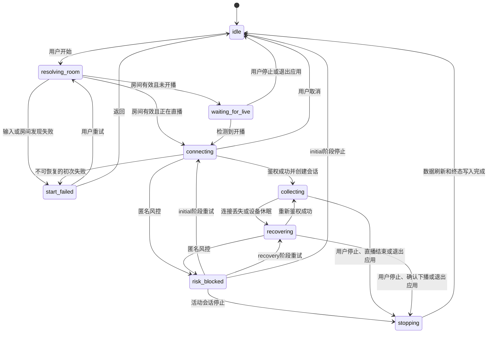

# 采集会话状态机

版本：`v1`

日期：2026-07-29

## 目标

状态机由Electron主进程唯一持有。关闭或最小化窗口只改变界面可见性，不改变采集状态。渲染进程和菜单栏只能发送操作意图并订阅状态快照，不能自行推进状态。

## 运行状态

| 状态 | 是否存在活动会话 | 含义 | 允许的主要操作 |
| --- | --- | --- | --- |
| `idle` | 否 | 没有等待目标，也没有采集 | 开始、查看历史、删除历史、退出应用 |
| `resolving_room` | 否 | 正在校验输入并解析真实房间号 | 取消、退出应用 |
| `waiting_for_live` | 否 | 房间存在但尚未开播，后台轮询 | 停止等待、显示或隐藏窗口、退出应用 |
| `connecting` | 否 | 房间已开播，正在完成初次引导和鉴权 | 取消、显示或隐藏窗口、退出应用 |
| `collecting` | 是 | 已鉴权并持续接收、存储和聚合事件 | 停止采集、显示或隐藏窗口、退出应用 |
| `recovering` | 是 | 活动会话暂时没有有效连接，正在自动恢复 | 停止采集、立即重试、显示或隐藏窗口、退出应用 |
| `risk_blocked` | 可选 | 匿名请求被风控。初次连接时没有会话，采集中断后仍保留活动会话 | 停止、立即重试、显示或隐藏窗口、退出应用 |
| `start_failed` | 否 | 初次启动在建立会话前失败 | 重试、修改房间、返回空闲、退出应用 |
| `stopping` | 可选 | 正在停止网络活动、写入终态并刷新数据库 | 显示或隐藏窗口，等待结束 |

`risk_blocked`携带`phase`：

- `initial`：尚未成功鉴权，不创建历史会话。
- `recovery`：已经存在活动会话，保持数据缺口并继续尝试恢复。

## 状态图

## 开始与等待开播

1. 用户提交房间号或直播链接后进入`resolving_room`。
2. 输入无效、房间不存在或响应不符合协议时进入`start_failed`，不创建历史会话。
3. 房间未开播时进入`waiting_for_live`，每15秒轮询一次房间状态，加入不超过20%的随机抖动。
4. macOS从休眠恢复或网络恢复时立即补一次状态检查，不等待下一个轮询周期。
5. 等待期间停止、关闭应用或更换房间都不创建历史会话。
6. 检测到开播后进入`connecting`。
7. 对已经开播的房间，解析完成后直接进入`connecting`。

## 创建采集会话

初次WebSocket鉴权成功后，按以下顺序执行：

1. 暂存鉴权后到达的少量消息，暂存区设置条数和字节上限。
2. 在一个数据库事务中创建采集会话，写入真实房间号、房间快照、开始时间、适配器版本和活动状态。
3. 写入首次连接状态。
4. 提交事务后进入`collecting`，再把暂存消息送入正常写入队列。

采集会话开始时间取鉴权成功时间。初次连接、WBI失败和匿名风控发生在这之前，因此不会产生空历史会话。

## 正常采集

`collecting`期间：

- WebSocket接收、解码、规范化、存储和增量聚合持续运行。
- 每10秒更新一次活动会话检查点。
- 窗口关闭、最小化和重新打开不触发状态转换。
- 菜单栏显示房间、采集时长和连接摘要，操作仍发送给主进程。
- 用户不能直接切换房间，必须先结束当前活动会话。

以下情况进入`recovering`：

- WebSocket异常关闭。
- 心跳失活。
- DNS、TLS或节点错误。
- macOS进入休眠。
- 网络连接丢失。
- 连续协议解码错误达到协议适配器阈值。
- 数据库暂时无法写入或有界写入队列达到上限。

进入`recovering`的同一事务中打开数据缺口。

存储故障发生后先关闭WebSocket，避免继续接收却无法持久化。存储探测恢复并刷新已有积压后，才重新连接直播间。

## 自动恢复

### 数据缺口

- 缺口开始时间取首次确认连接不可用的时间。
- 一段连续离线期间只保留一个缺口，不因每次重试拆成多个区间。
- 恢复鉴权成功时关闭缺口，结束时间取成功时间。
- 若用户停止、直播结束或应用有序退出，未关闭的缺口以会话结束时间关闭。
- 缺口保存首次原因、最后原因、尝试次数和是否恢复，不保存原始上游响应。

### 节点与退避

- 当前节点失败后按协议契约轮换节点。
- 网络或上游错误采用`1、2、4、8、16、30`秒退避，之后保持30秒上限，并加入不超过20%的随机抖动。
- 单轮节点耗尽后重新获取WBI材料、指纹、临时令牌和节点列表。
- 同一时间只允许一个连接尝试，旧连接关闭后才能启用新连接。
- 恢复期间每30秒检查一次房间状态。

### 匿名风控

收到`-352`或适配器归类的匿名风控时进入`risk_blocked`。

- `initial`阶段不创建会话，也不创建缺口。
- `recovery`阶段保留活动会话及已经打开的缺口。
- 自动重试间隔依次为`30、60、120、300`秒，之后保持300秒上限，并加入随机抖动。
- 用户可以触发立即重试，但连续点击只合并成一次请求。
- 第一版不提供Cookie回退。

### 确认下播

满足任一条件时按正常下播结束：

- 已连接时收到明确的`PREPARING`命令。
- 恢复期间连续两次房间状态检查都返回未开播，两次间隔不少于5秒。

一次临时房间状态异常不能结束会话。轮播状态保留为房间状态，不自动当作正常直播。

## 停止与终态

### 用户停止

用户在`collecting`、`recovering`或`risk_blocked`的`recovery`阶段停止时：

1. 进入`stopping`并禁止新的连接尝试。
2. 关闭WebSocket和计时器。
3. 关闭未结束的数据缺口。
4. 刷新事件批次与聚合检查点。
5. 把会话标记为`completed`，结束原因为`user_stop`。
6. 返回`idle`。

初次连接或等待开播阶段的停止直接返回`idle`，不创建会话。

### 正常下播

确认下播后执行与用户停止相同的刷新流程，会话结束原因为`live_ended`。

### 退出应用

菜单栏退出、`Cmd+Q`和系统正常终止请求都属于有序退出：

- 等待开播和初次连接直接停止，不创建会话。
- 存在活动会话时进入`stopping`，结束原因为`app_quit`。
- 数据刷新完成后才能允许Electron主进程退出。
- 设置有上限的退出等待时间。超过上限时保留活动标记，让下次启动按异常中断恢复，不能伪造为有序结束。

关闭主窗口不属于退出应用。

### 异常中断恢复

活动会话每10秒写入一次检查点。有序结束会在同一事务中写入终态并清除活动标记。

应用启动时发现残留活动标记：

1. 不自动连接原直播间。
2. 结束时间取以下时间中的最大值：最后活动检查点、最后持久化事件时间、最后持久化状态转换时间。
3. 若当时存在未关闭的数据缺口，则以结束时间关闭缺口并标记为未恢复。
4. 会话状态改为`interrupted`，结束原因为`process_interrupted`。
5. 写入发现异常中断的本地时间，供诊断使用，但不把应用未运行的时间计入采集时长。
6. 完成恢复事务后进入`idle`。

## 持久化转换

必须持久化：

- 会话创建。
- 首次连接成功。
- 数据缺口开始与结束。
- 风控开始与解除。
- 确认下播。
- 用户停止请求。
- 有序退出请求。
- 会话终态。
- 异常中断恢复。

不逐条持久化：

- 每次节点尝试。
- 每次退避计时。
- 窗口显示、隐藏和最小化。
- 每次等待开播轮询。

重试次数和最后错误类别写入当前缺口或会话诊断摘要，避免产生大量状态记录。

## 会话终态

| 状态 | 结束原因 | 是否正常完成 | 是否自动恢复 |
| --- | --- | --- | --- |
| `completed` | `user_stop` | 是 | 否 |
| `completed` | `live_ended` | 是 | 否 |
| `completed` | `app_quit` | 是 | 否 |
| `interrupted` | `process_interrupted` | 否 | 否 |

会话一旦进入终态就不可重新打开。用户再次采集同一房间会创建新的采集会话。

## 并发与幂等约束

- 所有外部操作都带单调递增的运行代次。旧代次的异步回调不能改变当前状态。
- `start`在非`idle`状态下返回当前状态，不重复启动。
- `stop`可以重复调用，只执行一次停止流程。
- 连接成功、缺口打开、缺口关闭和会话结束都使用数据库唯一约束或状态条件保证幂等。
- 收到晚到的WebSocket消息时，只有消息所属运行代次与活动会话一致才允许入队。
- 数据库刷新完成之前，不向界面发布已经结束的终态。

## 用户可见状态

主界面和菜单栏使用同一份主进程快照，至少包含：

- 运行状态。
- 房间号与房间标题。
- 是否存在活动会话。
- 会话开始时间与采集时长。
- 当前连接状态。
- 当前缺口开始时间。
- 重试次数与下次重试时间。
- 脱敏错误类别。
- 最后收到消息的时间。

界面文字可以更友好，但不能把`recovering`显示成仍在正常采集，也不能把数据缺口显示为零弹幕。

## 验收场景

1. 未开播房间等待10分钟后停止，不产生历史会话。
2. 等待期间检测到开播，鉴权成功后只创建一个会话。
3. 初次连接触发风控，多次重试后停止，不产生历史会话。
4. 正常采集中断网30秒，产生一个缺口，恢复后继续同一会话。
5. 恢复期间多次节点失败，缺口不被拆分。
6. 收到`PREPARING`后正常结束，批次全部写入。
7. 恢复期间连续确认未开播，按正常下播结束。
8. 关闭窗口后继续收取并存储事件，重新打开后状态和计数连续。
9. 采集中通过菜单栏退出，结束原因为`app_quit`。
10. 采集中强制终止进程，重新启动后标记为`process_interrupted`且不自动恢复。
11. macOS休眠后恢复，记录一个缺口并自动重连。
12. 连续点击开始、停止和立即重试不会产生双连接、双会话或重复终态。
