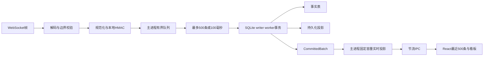

# 高吞吐与实时聚合规格

版本：`v1`

日期：2026-07-29

## 1. 结论

第一版采用以下方案：

- WebSocket接收路径只完成解码、边界校验、HMAC规范化和入队，不执行SQLite或全场聚合。
- 主进程保留有界双端队列，writer worker按最多500条或100毫秒提交事务。
- writer worker在同一事务内更新事实表、会话摘要、10秒统计桶和活跃用户投影。
- 事务提交后才把投影增量和数据库高水位返回主进程。
- 主进程只保存最近500条弹幕、最近180个10秒桶、128个高频词候选和当前指标，不保存整场内存副本。
- renderer每250毫秒最多接收一次弹幕和数字，每1秒最多接收一次分析投影，单包不超过256 KiB。
- 高频词采用固定容量Space-Saving近似计数，活跃用户和事实计数保持精确。

在当前Apple Silicon Mac上，脱敏原型已通过100万条容量验证和120秒定速200条/秒验证。12小时测试属于正式实现的发布门槛，不能用本次短时原型结果替代。

原型与运行命令见[高吞吐与实时聚合原型](../prototypes/throughput/README.md)，实测记录见[高吞吐原型验证记录](../research/throughput-prototype-2026-07-29.md)。

## 2. 数据路径



不可破坏的顺序：

1. 上游数据通过运行时校验。
2. 原始UID在主进程转换为本地用户标识。
3. 规范化事件进入有界队列。
4. writer worker事务成功。
5. 主进程收到`CommittedBatch`。
6. 实时投影和renderer才看到事件。

去重冲突不进入事实计数和任何投影。事务回滚的批次不改变主进程投影。

## 3. 接收队列与批次

### 3.1 接收队列

- 使用支持头部常数时间移除的有界双端队列，不使用随长度增长反复移动元素的数组头删。
- 队列同时受两项限制：
  - 最多20,000个规范化事件。
  - 最老事件最多等待5秒。
- 任一限制先达到，就停止读取业务消息、关闭WebSocket并进入`storage`恢复流程。
- 队列指标至少包括当前条数、最老等待时间、历史峰值和拒绝次数。
- 不允许为了界面在线而静默丢弃事实事件。

### 3.2 批次触发

- 队列达到500条时立即取出一个批次。
- 未达到500条时，从首条待写事件入队起最多等待100毫秒。
- 同一时刻只有一个writer事务在途。
- writer完成后立即处理已达到条件的下一批，不额外等待计时器。
- 单批消息传递只包含规范化字段，不包含上游原始消息或临时凭据。

每秒200条时，正常批次约20条。500条上限用于吸收短时突发和worker恢复后的有界积压。

### 3.3 WAL

- 使用`WAL`和`NORMAL`同步级别。
- 设置`wal_autocheckpoint=1000`页。
- 活动采集期间每100个提交批次执行一次被动检查点。
- 会话结束或应用空闲时执行截断检查点。
- WAL超过64 MiB时额外触发被动检查点并记录脱敏诊断。
- WAL连续两次检查点后仍超过128 MiB时进入存储告警，但不在接收回调中同步处理。

## 4. 增量聚合

### 4.1 会话摘要

writer worker从本批成功插入的事件生成一次增量：

- 弹幕条数。
- 新增活跃用户数。
- 礼物事件数和礼物新增数量。
- 已知礼物价值与未知价值数量。
- 醒目留言条数与价值。
- 最后热度与峰值热度。
- 最后消息时间。
- 本场首条与末条弹幕事实ID。

同一事务使用单条`UPDATE`合并到`session_metrics`。应用层不能在每个事件后单独更新摘要。

### 4.2 活跃用户

- 只统计普通弹幕且`local_user_key`非空的事件。
- 一个批次先按本地用户标识合并，再执行一次批量UPSERT。
- 新行增加`active_user_count`，已有行只增加弹幕数并更新最后昵称和时间。
- 内存只保留当前批次的用户增量和界面前10名，不保留全场用户集合。
- 活跃用户前20名从`session_users_active_rank`索引读取。

### 4.3 10秒桶和当前速率

- `bucket_start_ms = floor(received_at_ms / 10000) * 10000`。
- 一个批次先按桶聚合，再UPSERT每个受影响的桶。
- 主进程固定保留最新180个桶，对应最近30分钟。
- 更早的桶只在SQLite中存在。
- 数据缺口覆盖的时间不补零。

当前弹幕速率使用最近60秒内最多6个桶：

```text
rate_per_minute =
  最近60秒已确认接收的弹幕数
  / 最近60秒内有效采集秒数
  * 60
```

- 有效采集秒数排除数据缺口。
- 有效采集不足10秒时显示正在计算，不显示剧烈波动的外推值。
- 当前桶按已经经过的有效秒数计算。
- 恢复连接后的前10秒重新显示正在计算。

### 4.4 高频词

高频词规则以[直播事件模型与SQLite结构](./event-model-and-sqlite.md)为准：

- `Intl.Segmenter`中文分词。
- 每条弹幕最多6个去重词。
- 单场固定128个Space-Saving候选。
- 每秒最多持久化一次候选快照。
- renderer只接收前10项。

`estimated_count`和`error_upper_bound`必须成对保存。界面不把估算值显示成精确百分比。

### 4.5 最近弹幕

主进程使用固定容量环形缓冲保存最近500条已提交弹幕：

- 新事件覆盖最旧事件。
- renderer可见时，待推送队列最多保留最新200条。
- 超过200条的展示增量只增加`displaySkippedCount`，事实事件仍完整保存。
- renderer隐藏时不积累待推送消息，只更新主进程环形缓冲。
- 重新显示窗口后发送完整500条快照。

React列表最多保留500个弹幕条目。虚拟列表可以使用，但不能以它为理由保留无限React状态。

## 5. IPC节流

| 内容 | 最大频率 | 最大条数 |
| --- | --- | --- |
| 采集状态变化 | 状态变化时，50毫秒合并重复值 | 1个完整状态 |
| 新弹幕与核心数字 | 每250毫秒 | 最新200条弹幕 |
| 趋势、高频词、活跃用户 | 每1秒 | 180个桶、10个词、10个用户 |

每个实时载荷在发送前计算UTF-8 JSON字节数：

- 不超过256 KiB时正常发送。
- 超过时继续裁剪最旧的待展示弹幕，直到满足上限。
- 固定投影仍超限属于程序错误，记录公开错误码并停止向renderer发送该包。
- renderer消费速度不能反向阻塞writer worker。

会话停止前执行一次最终投影推送，随后发送终态。窗口隐藏或renderer不可用时跳过最终界面推送，但不能跳过数据库刷新。

## 6. 搜索策略

FTS5三元组分词器不能匹配少于3个Unicode字符的查询。第一版按查询长度分流：

- 1至2个字符：在reader worker中使用参数化`instr(text, ?) OR instr(display_name, ?)`，限定当前会话并按时间线倒序扫描。
- 3至200个字符：使用FTS5`trigram`。

FTS查询必须先物化匹配ID：

```sql
WITH matches AS MATERIALIZED (
  SELECT rowid
  FROM danmaku_fts
  WHERE danmaku_fts MATCH :escaped_phrase
    AND rowid BETWEEN :first_event_id AND :last_event_id
)
SELECT d.id, d.received_at_ms, d.display_name, d.text
FROM matches
JOIN danmaku_events d ON d.id = matches.rowid
WHERE d.session_id = :session_id
  AND (
    d.received_at_ms < :cursor_time
    OR (d.received_at_ms = :cursor_time AND d.id < :cursor_id)
  )
ORDER BY d.received_at_ms DESC, d.id DESC
LIMIT 100;
```

第一页省略游标条件。纯文本短语必须由查询构造器转义，不能直接接受FTS语法。

原型中直接关联FTS的写法在100万条时热查询约2.1秒；使用物化匹配ID后热查询P95降至9.22毫秒。正式测试必须包含查询计划回归检查。

## 7. 脱敏合成负载

生成器只创建本地合成字段：

- 90%普通弹幕。
- 5%礼物事件。
- 1%醒目留言。
- 4%热度采样。
- 50,000个固定生成的16字节本地用户键。
- 固定中文词表、少量长文本和高基数合成词。
- 不读取线上直播包、原始UID、Cookie或临时凭据。

每次运行使用固定种子和固定事件选择规则，因此事实表计数可以精确预测。

## 8. 验证档位

| 档位 | 负载 | 用途 |
| --- | --- | --- |
| `smoke` | 加速写入20,000条 | 检查DDL、FTS、计数和worker消息 |
| `million` | 加速写入1,000,000条 | 验证容量、查询、WAL和固定投影 |
| `sustained` | 200条/秒，默认10分钟 | 验证100毫秒小批次、队列和事件循环 |
| `soak` | 12小时，平时20条/秒，每15分钟加入1分钟200条/秒 | 验证长期内存、检查点和生命周期 |

完整12小时负载应生成1,382,400条事件，其中1,244,160条弹幕、69,120条礼物、13,824条醒目留言和55,296条热度采样。

原型命令：

```bash
node --disable-warning=ExperimentalWarning docs/prototypes/throughput/benchmark.mjs --profile smoke
node --disable-warning=ExperimentalWarning docs/prototypes/throughput/benchmark.mjs --profile million
node --disable-warning=ExperimentalWarning docs/prototypes/throughput/benchmark.mjs --profile sustained
node --disable-warning=ExperimentalWarning docs/prototypes/throughput/benchmark.mjs --profile soak
```

正式实现必须提供等价的项目命令，并改用最终Electron版本、最终SQLite驱动和正式worker代码。原型的`node:sqlite`结果只说明方案有数量级余量。

## 9. 发布门槛

### 9.1 所有档位

- 生成数、成功提交数和事实表总数完全一致。
- FTS行数等于弹幕事实数。
- 会话摘要与事实表重建结果一致。
- 不发生队列拒绝、未处理异常、worker重启或静默丢弃。
- `PRAGMA quick_check`返回`ok`。
- 会话结束后截断检查点把WAL降为0字节。
- 最近弹幕不超过500，趋势不超过180，高频词候选不超过128。
- renderer实时载荷不超过256 KiB。

### 9.2 每秒200条

- 实际接收速率在目标值的98%至102%之间。
- 正常磁盘下主进程队列峰值不超过1,000条。
- writer提交P99不超过100毫秒。
- 主进程到writer往返P99不超过150毫秒。
- 主进程事件循环延迟P99不超过50毫秒，最大值不超过250毫秒。
- renderer弹幕推送不超过每秒4次，分析推送不超过每秒1次。

### 9.3 100万条

- 加速写入能力至少为每秒2,000条，保留相对每秒200条目标的10倍余量。
- 历史首屏新连接查询不超过500毫秒，热查询P95不超过200毫秒。
- 普通弹幕页热查询P95不超过200毫秒。
- 3字符以上FTS搜索新连接查询不超过1,500毫秒，热查询P95不超过500毫秒。
- 1至2字符无结果全场扫描新连接查询不超过1,500毫秒，热查询P95不超过500毫秒。
- 活跃用户、高频词和趋势热查询P95不超过200毫秒。
- WAL峰值不超过64 MiB。

原型中的新连接查询仍可能命中macOS文件缓存。正式冷启动门槛必须在重启应用后的独立进程中测量，不能把新连接结果称为操作系统冷缓存结果。

### 9.4 12小时

- 使用打包后的生产代码、生产SQLite驱动和生产worker。
- 测试前可用磁盘空间至少2 GiB。
- 前30分钟作为JIT、缓存和连接预热，不进入内存斜率计算。
- 30分钟后主进程与worker合计RSS线性回归斜率不超过1 MiB/小时。
- 窗口显示时全应用RSS峰值不超过500 MiB。
- 12小时内没有持续增长的队列、订阅监听器、计时器、最近弹幕或关键词候选。
- 每15分钟的200条/秒突发都通过每秒200条门槛。
- 最终1,382,400条事件和各类型计数完全匹配。

12小时门槛必须保存脱敏JSON摘要、应用版本、Electron版本、SQLite版本、机器架构、macOS版本、开始与结束时间。数据库和事件正文不进入Git。

## 10. 原型实测

环境：Apple Silicon、macOS 26.5.1、Node 24.14.1、内置`node:sqlite`。

### 100万条

- 1,000,000条在37.92秒内提交，约26,372条/秒。
- writer提交P99为55.91毫秒。
- 主线程事件循环P99为11.75毫秒。
- WAL峰值约21.15 MiB，停止后为0。
- 数据库约202.43 MiB。
- 实时载荷最大50,997字节。
- FTS热查询P95为9.07毫秒。
- 2字符无结果全场扫描热查询P95为227.64毫秒。
- 所有事实、FTS、摘要和固定容量检查通过。

### 定速200条/秒

- 120秒按计划精确生成并提交24,000条，实际200条/秒。
- 队列峰值24条。
- writer提交P99为9.71毫秒。
- 主进程到worker往返P99为10.89毫秒。
- 主线程事件循环P99为15.57毫秒，最大39.78毫秒。
- 弹幕推送约3.14次/秒，分析推送约0.79次/秒。
- 最大实时载荷11,024字节。
- RSS首个样本为75.05 MiB，最终样本为81.97 MiB。短时变化不用于判断长期泄漏。

这些结果证明方案有足够余量，不证明最终Electron应用已经通过12小时发布门槛。
